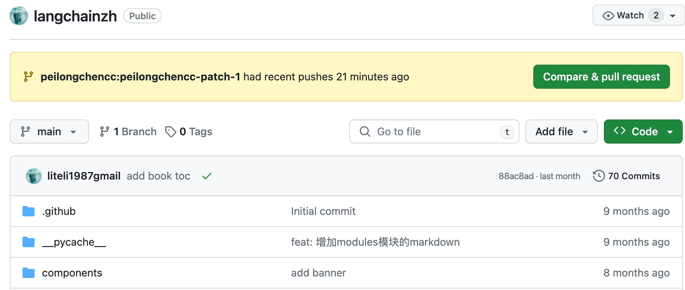

# Github Operate
记录Github的一些常见操作。 
- [Github Operate](#github-operate)
  - [将GitHub仓库从公开（public）更改为私人（private）:](#将github仓库从公开public更改为私人private)
  - [链接下划线去除：](#链接下划线去除)
  - [github中fork的使用:](#github中fork的使用)

## 将GitHub仓库从公开（public）更改为私人（private）:

要将GitHub仓库从公开（public）更改为私人（private），请按照以下步骤操作： 

1. 登录到你的GitHub账户。

2. 转到你要更改为私人的仓库的页面。

3. 单击仓库名称，进入仓库主页。

4. 单击仓库主页右上角的“Settings”（设置）选项。

5. 在仓库设置页面中，向下滚动，直到找到“Danger Zone”（危险区域）部分。

6. 在“Danger Zone”部分，你会看到“Change repository visibility”（更改仓库可见性）选项。单击它。

7. 在“Change repository visibility”页面上，你需要验证你的GitHub密码以确认你有权限进行此更改。

8. 输入你的GitHub密码并点击“Confirm password”（确认密码）按钮。(如果你使用的google，可以直接用google保存的密码。)

## 链接下划线去除：

默认情况下，GitHub对文本中的链接是标注下划线的，但可通过以下方式去除： 

1. 点击右上角头像；

2. 点击"Settings"；

3. 左侧菜单栏点击"Accessibility"；

4. 下拉进度条至"Content"模块；

5. 勾选"Hide link underlines"；

## github中fork的使用:

问题描述: 

GitHub上我发现某人的代码有问题，我fork他的仓库并创建一个分支，然后提交我的更改，能提醒作者吗？还是说需要专门联系作者？ 

解决方案: 

在GitHub上，如果你发现某个项目的代码有问题，并且已经fork了仓库、创建了分支并提交了更改，你可以通过创建一个**Pull Request**来通知原仓库的作者你所做的更改。这是GitHub协作的一个常见流程，不需要你专门去联系作者。以下是具体步骤： 

1. **推送更改到你的分支**：首先，确保你在你的分支上的更改已经推送到了GitHub。

2. **创建Pull Request**：
   - 在GitHub上，导航到你fork的仓库的页面。
   - 点击“New pull request”按钮。
   - 选择你的分支和原仓库的相关分支（通常是原仓库的主分支）。
   - 填写Pull Request的标题和描述，清晰地说明你所做的更改和为什么这样做。
   - 提交Pull Request。

出现以下界面，需点击 `"Compare & pull request"`: 

3. **等待反馈**：提交Pull Request后，原仓库的维护者会收到通知。他们可以查看你的更改，提出反馈或者直接合并你的更改到他们的仓库中。

4. **可能的讨论**：维护者可能会在Pull Request上提出问题或者要求进一步的更改。这通常会在GitHub的Pull Request页面上以评论的形式出现。

通过这种方式，你就可以在不需要直接联系原作者的情况下，向他们提出更改建议，并且促进代码的改进和协作。 