# connect_remote_server
记载笔者通过 终端/vscode 连接阿里云远程服务器的一些经验，包括如何连接远程服务器，出现的错误和相应的解决方案。<br>
- [connect\_remote\_server](#connect_remote_server)
  - [连接阿里云服务器：](#连接阿里云服务器)
    - [进入实例：](#进入实例)
    - [重置实例密码：(可选)](#重置实例密码可选)
    - [workbench连接阿里云服务器：](#workbench连接阿里云服务器)
    - [终端、vscode连接阿里云服务器：](#终端vscode连接阿里云服务器)
    - [通过ssh密钥连接--创建密钥对：(强烈推荐🤭🤭🤭)](#通过ssh密钥连接--创建密钥对强烈推荐)
    - [将别人的SSH密钥添加到自己的Ubuntu 18.04服务器:](#将别人的ssh密钥添加到自己的ubuntu-1804服务器)
  - [使用阿里云提供的Redis时流量占用问题：](#使用阿里云提供的redis时流量占用问题)
    - [问题描述：](#问题描述)
    - [阿里云客服回应：](#阿里云客服回应)
  - [阿里云服务器连接不到github的解决方案:](#阿里云服务器连接不到github的解决方案)
  - [阿里云的RAM用户登陆和普通用户登陆有区别吗？](#阿里云的ram用户登陆和普通用户登陆有区别吗)
  - [cannot create temp file for here-document: No space left on device](#cannot-create-temp-file-for-here-document-no-space-left-on-device)
  - [Could not establish connection to "xxx.xxx.xxx.xxx": Cannot read properties of undefined (reading 'replace').](#could-not-establish-connection-to-xxxxxxxxxxxx-cannot-read-properties-of-undefined-reading-replace)
  - ["项目部署在AWS的Lambda"是什么意思？](#项目部署在aws的lambda是什么意思)
  - [服务器连接openai:](#服务器连接openai)
    - [ubuntu 18.04 安装 GNOME 桌面环境:](#ubuntu-1804-安装-gnome-桌面环境)
    - [阿里云服务器VNC无法登录问题:](#阿里云服务器vnc无法登录问题)
      - [无法登录，提示 "Sorry, that didn't work. Please try again.":](#无法登录提示-sorry-that-didnt-work-please-try-again)
    - [登录后提示"Error found when...":](#登录后提示error-found-when)
    - [安装monocloud for Linux:](#安装monocloud-for-linux)
    - [终端科学上网:](#终端科学上网)
      - [临时启用代理:](#临时启用代理)
      - [永久使用代理:](#永久使用代理)
    - [测试代码效果:](#测试代码效果)
  - [将"ip+port"改为通过域名访问自己的服务:](#将ipport改为通过域名访问自己的服务)
    - [域名购买与实名认证:](#域名购买与实名认证)
    - [域名解析配置:](#域名解析配置)
    - [ICP备案:](#icp备案)
    - [服务器开启端口：](#服务器开启端口)
    - [使用 Certbot 正在为指定的域名获取一个(新的) SSL/TLS 证书:](#使用-certbot-正在为指定的域名获取一个新的-ssltls-证书)
    - [验证SSL证书是否有效(可选):](#验证ssl证书是否有效可选)
    - [Nginx配置:](#nginx配置)
      - [安装Nginx:](#安装nginx)
      - [配置Nginx:](#配置nginx)
      - [重定向 HTTP 到 HTTPS（可选）:](#重定向-http-到-https可选)
      - [答疑-Nginx配置中哪部分表示了"www"记录？哪部分表示了"@"记录？](#答疑-nginx配置中哪部分表示了www记录哪部分表示了记录)
      - [检查配置文件的语法并重新启动 Nginx:](#检查配置文件的语法并重新启动-nginx)

## 连接阿里云服务器：
### 进入实例：
进入个人阿里云主界面后点击相应实例名，然后点击控制台即可进入自己选择的实例～<br>


### 重置实例密码：(可选)
如果你忘记了自己阿里云服务器的密码，可以通过实例的主界面点击 `重置实例密码` 重新设置密码，可以参考以下图片：<br>


然后会弹出下列界面：<br>


### workbench连接阿里云服务器：
可以通过密码连接阿里云服务器，也可以通过密钥连接阿里云服务器，这里先介绍一下通过密码连接阿里云服务器。<br>
1. 点击远程连接


2. 现在，你应该能看到以下界面，点击"立即登录"即可


3. 选择"密码认证"，然后输入个人用户名和密码，点击"确认"


现在，你应该已经进入了阿里云服务器界面了。但我不得不提醒你，通过这种方式操作很不方便，且相应速度很慢，最好的方式还是通过IDE或终端的方式连接阿里云服务器，简洁、速度快🚀🚀🚀<br>
<br>

### 终端、vscode连接阿里云服务器：
终端、vscode可以使用密码连接阿里云服务器，终端可以输入以下指令：<br>
```bash
ssh root@8.140.203.xxx
```
将 `IP` 部分改为你自己的远程服务器公网IP即可，示意图如下：<br>


vscode等IDE远程连接服务器，然后操作代码，这才是我们最常见的情况。vscode等IDE远程连接服务器需要下载ssh插件，以vscode为例，需要在主界面左侧的 `拓展` 中搜索以下内容进行安装：<br>


然后按照下图创建连接：<br>


在弹出的窗口中输入以下指令：<br>
```bash
ssh root@8.140.203.xxx
```
回车后，会提示你输入密码。如果没有问题，你就会进入远程服务器中～🐳🐳🐳<br>
<br>

### 通过ssh密钥连接--创建密钥对：(强烈推荐🤭🤭🤭)
虽然用密码连接远程服务器也挺方便，但你如果用远程服务器非常频繁，就会觉得每次输密码实在太累，那么你就可以考虑使用密钥对连接远程服务器。<br>

🚨🚨🚨**首先提醒一点**：一定要选择阿里云自己创建的密钥队，自己上传的ssh-rsa之类算法的密钥队是不支持的，阿里云自己创建的是pem密钥对，点击创建密钥队后，私钥pem会自动在远程服务器中创建，公钥pem会自动下载到本地。<br>

操作方式如下：<br>


接下来需要将公钥pem放到指定位置，可以放到常规远程连接密钥存放的位置，也可以自定义位置。常规远程连接密钥存放的位置为：<br>
```bash
~/.ssh/
```

我们还需要修改公钥pem的权限，要为存放的公钥pem设置权限，否则会提示你 `权限过于开放，无法连接`。示例图如下：<br>


为存放的公钥pem设置权限很简单，根据自己存放公钥pem文件的路径，输入以下指令即可：<br>
> 笔者使用的是mac，如果你使用的是win，不保证下列指令正常使用。

```bash
chmod 600 /Users/peilongchencc/Desktop/personal_aliyun_keys/peilongchencc_mac_20230808.pem
```

修改config文件内容：
如果想快速修改config文件，可以使用以下指令：<br>
```bash
vim ~/.ssh/config
```
直接添加就行，不需要做额外的修改。可以参考下图：<br>


现在，无论你使用终端，还是使用vscode等IDE，都可以直接连接远程服务器了。～<br>

终端输入以下指令，会自动连接到远程服务器。<br>
```bash
ssh root@8.140.203.xxx
```

vscode更智能，直接按下图点击选项即可：<br>


<br>

### 将别人的SSH密钥添加到自己的Ubuntu 18.04服务器:

要将别人的SSH密钥添加到你的Ubuntu 18.04服务器中的`deployer`账户，你可以按照以下步骤操作：<br>

1. **获取密钥**：首先，确保你获得了对方的公共SSH密钥。这通常是一个`.pub`文件，例如`id_rsa.pub`。

2. **登录到服务器**：使用你的`deployer`账户登录到服务器。你可以使用SSH客户端来完成这一步，例如通过命令`ssh deployer@your_server_ip`。

3. **编辑authorized_keys文件**：

  - 切换到`deployer`用户的主目录（如果你已作为`deployer`登录，那么你应该已经在这个目录里，或者 `cd /home/deployer` 进入该目录）。
 
  - 查找(`ll -a`)一个名为`.ssh`的目录。如果没有，可以使用命令`mkdir -p ~/.ssh`来创建这个目录。
 
  - 在`.ssh`目录中，有一个名为`authorized_keys`的文件用于存储公钥。如果该文件不存在，你可以创建它。
 
  - 使用文本编辑器（如`vim`）打开`authorized_keys`文件。例如，`vim ~/.ssh/authorized_keys`。

4. **添加公钥**：将对方的公钥（从`.pub`文件中获得）复制并粘贴到`authorized_keys`文件中。每个密钥应该占一行。

5. **保存并关闭文件**：保存`authorized_keys`文件并关闭编辑器。

6. **设置权限**：

  - 如果其他人已经设置过权限，可以跳过这一步。

  - 确保`.ssh`目录的权限是700（只有所有者可以读写执行）。使用命令`chmod 700 ~/.ssh`。
 
  - 确保`authorized_keys`文件的权限是600（只有所有者可以读写）。使用命令`chmod 600 ~/.ssh/authorized_keys`。

7. **测试连接**：让对方尝试使用他们的SSH私钥连接到你的服务器，看是否成功。

完成这些步骤后，对方应该能够使用他们的SSH密钥登录到你的服务器上的`deployer`账户。<br>

## 使用阿里云提供的Redis时流量占用问题：

### 问题描述：

我的服务向阿里云提供的redis写入数据，和从阿里云提供的redis获取数据会占用流量吗？<br>

### 阿里云客服回应：

```log
您好：

请问，我的服务向阿里云提供的redis写入数据，和从阿里云提供的redis获取数据会占用流量吗？

----您可以理解为会占用带宽

Redis实例作为更靠近应用服务的数据层，通常会执行较多的数据存取并消耗网络带宽。不同的实例规格对应的最大带宽有所不同，当超过该规格的最大带宽时，将对应用服务的数据访问性能造成影响。

参考文档：

排查Redis实例流量使用率高的问题  https://help.aliyun.com/zh/redis/user-guide/troubleshoot-high-traffic-usage-on-an-apsaradb-for-redis-instance?spm=a2c4g.11174283.0.i10
```
<br>


## 阿里云服务器连接不到github的解决方案:

阿里云 `ping github.com` 看下解析到的IP是：`20.205.243.166`，这个github节点有问题导致访问超时。<br>

在 `/etc/hosts` 文件中将 github.com 指定到 `20.27.177.113` 这个IP上可以连接github。<br>

即，终端 `vim /etc/hohsts` 然后再最后一行添加:<br>

```bash
20.27.177.113   github.com
```


## 阿里云的RAM用户登陆和普通用户登陆有区别吗？

阿里云（Alibaba Cloud）的RAM（Resource Access Management）用户登录和普通用户登录确实存在一些区别，这些区别主要体现在权限管理、访问控制和用途上：<br>

1. **用户类型**:

- **普通用户**: 通常指的是拥有阿里云账户的主用户，可以访问和管理阿里云的所有资源和服务，具有账户的最高权限。

- **RAM用户**: 是在主账户下创建的子账户，通常用于对权限进行细粒度的控制。通过为RAM用户分配不同的权限，账户拥有者可以限制他们可以访问和管理的资源范围。

2. **登录方式**:

- **普通用户登录**: 通常通过阿里云主页面登录，使用注册时设置的邮箱或手机号和密码。

- **RAM用户登录**: 通常通过RAM用户的登录链接进行，该链接是由主账户用户提供的，RAM用户需要该特定的URL，以及他们的用户名和密码。

3. **权限管理**:

- **普通用户**: 拥有对账户下所有资源的完全控制权，可以创建和管理RAM用户，分配权限等。
- **RAM用户**: 权限受限，只能进行被授权的操作，这有助于遵循最小权限原则，降低安全风险。

4. **用途**:

- **普通用户**: 适用于账户的主要拥有者和需要完全控制的管理员。

- **RAM用户**: 适合需要对不同员工或系统分配不同权限的情况，例如开发者、审计员或只需要访问特定服务的应用程序。

通过这种方式，阿里云用户可以更安全、更灵活地管理他们的资源和权限。在实际使用中，根据具体的业务需求和安全要求选择合适的用户类型和权限设置非常重要。<br>


## cannot create temp file for here-document: No space left on device

当你使用 `cd` 指令时，如果一直提示下列信息，表明你的服务器上的磁盘空间已经用完，无法创建临时文件来处理一个"here-document"。<br>

```bash
cannot create temp file for here-document: No space left on device
```

"here-document" 是一种用于在shell脚本中包含多行文本的方式。当服务器上的磁盘空间不足时，系统无法创建所需的临时文件，从而导致这个错误。<br>

🚨🚨🚨要解决这个问题，你可以采取以下步骤：<br>

**检查磁盘空间使用情况：**<br> 

首先，使用 `df -h` 命令来查看服务器上各个分区的磁盘空间使用情况。这将显示磁盘空间使用百分比以及可用空间。<br>

```bash
df -h
```

通过查看这些信息，确定哪个分区的空间已经耗尽。<br>

**清理不必要的文件：**<br>

如果你确定哪个分区空间不足，可以尝试删除不必要的文件或日志，以释放磁盘空间。使用 `rm` 命令来删除文件，或者 `find` 命令来查找和删除较旧或不需要的文件。<br>

例如，删除旧日志文件：<br>

```bash
rm /path/to/old/log/files/*.log
```

**查找大文件：**<br>

使用 `du` 和 `sort` 命令来查找占用磁盘空间较多的文件或目录。例如，以下命令将列出指定目录中最大的文件：<br>

```bash
du -h /path/to/directory | sort -rh | head -n 10
```

这将显示前10个最大的文件或目录。<br>

**清空临时文件：**<br> 

有时，服务器上的临时文件可能占用了大量磁盘空间，例如 `nohup.out` 文件。你可以使用 `rm` 命令来删除不再需要的临时文件。<br>

**增加磁盘空间：**<br> 

如果磁盘空间问题经常发生，可能需要考虑增加服务器的磁盘空间，或者将一些数据迁移到其他存储设备。<br>

**检查日志文件：**<br> 

如果你的服务器有日志记录问题，日志文件可能会快速增长，导致磁盘空间耗尽。检查并限制日志文件的大小，以避免此问题。<br>

🥹🥹🥹一旦你释放了足够的磁盘空间，你应该能够解决这个错误并正常执行你的任务。确保定期监视服务器的磁盘空间使用情况，以及时采取措施来防止空间不足的问题。笔者解决这个问题就是通过删除了一些占用空间巨大的文件夹。🫠🫠🫠🫠<br>
<br>

## Could not establish connection to "xxx.xxx.xxx.xxx": Cannot read properties of undefined (reading 'replace').

情况描述：使用终端连接远程服务器正常，但使用 vscode 连接远程服务器时，出现错误提示:

```txt
Could not establish connection to "xxx.xxx.xxx.xxx": Cannot read properties of undefined (reading 'replace').
```

解决方案：<br>

1. 点击 vscode 中的拓展模块；

2. 点击远程连接的插件，我使用的是 Remote Explorer；

3. 将 Remote 版本切换为 "预发布" 版本；("预览"-->"预发布")


## "项目部署在AWS的Lambda"是什么意思？

"项目部署在AWS的Lambda" 这句话是关于云计算服务的。这里的“项目”指的是某种软件应用或代码，而“部署”是指在某个平台上设置和运行这个应用或代码。<br>

AWS（Amazon Web Services）是亚马逊提供的一种云计算服务平台。Lambda是AWS提供的一种服务，允许你运行代码而不需要管理服务器。在Lambda上部署项目意味着你的代码会在AWS的云基础设施上运行，而无需担心底层服务器的维护和管理。<br>

使用AWS Lambda的优点包括：<br>

1. **无服务器架构**：你不需要管理或维护服务器，只需关注你的代码。

2. **按需定价**：你只需为代码执行时消耗的计算资源付费。

3. **自动扩展**：Lambda可以根据需要自动增加或减少计算资源，以适应应用程序的需求。

4. **事件驱动**：Lambda可以配置为响应AWS内的各种事件，如文件上传到S3、更新数据库等。

总之，这是一种现代的、高效的方式来运行和扩展应用程序，特别适合那些希望减少基础设施管理负担的开发者或企业。<br>


## 服务器连接openai:

服务器连接openai首先要服务器支持科学上网，以笔者使用的monocloud为例进行讲解。<br>

由于monocloud只支持图形化界面的Linux安装，故笔者先介绍 ubuntu 18.04 图形化界面安装。<br>

### ubuntu 18.04 安装 GNOME 桌面环境:

要在 Ubuntu 18.04 服务器版本上安装 GNOME 桌面环境，你可以按照以下步骤操作：<br>

1. **更新系统软件包列表**：

首先，打开终端并更新系统的软件包列表。这可以确保你安装的是最新版本的软件包。运行以下命令：<br>

```bash
sudo apt update
```

2. **升级系统**：

推荐升级所有现有的软件包到最新版本。运行以下命令：<br>

```bash
sudo apt upgrade
```

这可能需要一些时间，具体取决于你的系统和网络速度。<br>

3. **安装 GNOME 桌面环境**：

安装 GNOME 桌面，只需运行以下命令：<br>

```bash
sudo apt install ubuntu-desktop
```

`ubuntu-desktop` 是 Ubuntu 的标准桌面环境，包括 GNOME 和其他必需的软件包。<br>

4. **启动图形界面**：

安装完成后，你可以通过运行以下命令来启动图形界面：<br>

```bash
sudo systemctl start gdm3
```

如果你希望在系统启动时自动进入图形界面，可以确保 gdm3（GNOME Display Manager）已被设置为默认的显示管理器。通常，安装过程会自动处理这个步骤。<br>

5. **重新启动**：

重启你的系统以应用更改：<br>

> 或者可以重启实例。

```bash
sudo reboot
```

重启后，你应该能看到 GNOME 的登录界面。<br>

请注意，安装图形化桌面环境可能会消耗相当多的系统资源，特别是在内存和处理器方面。如果你的服务器资源有限，请考虑这一点。此外，确保你的服务器有足够的硬盘空间来容纳额外的软件包。(大约1～2G空间)<br>

### 阿里云服务器VNC无法登录问题:

首先，注意阿里云服务器的VNC登录不支持特殊字符输入，可以使用登录界面左上角的 `复制命令输入` 进行特殊字符的输入。<br>

> 特殊字符主要出现在你的密码中，或者你可以选择修改密码。

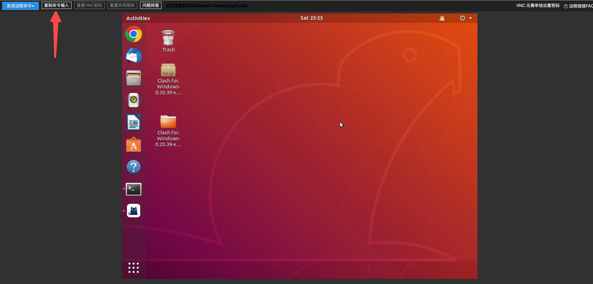


#### 无法登录，提示 "Sorry, that didn't work. Please try again.":

如果你在账号密码正确的情况下，遇到 "Sorry, that didn't work. Please try again.":<br>

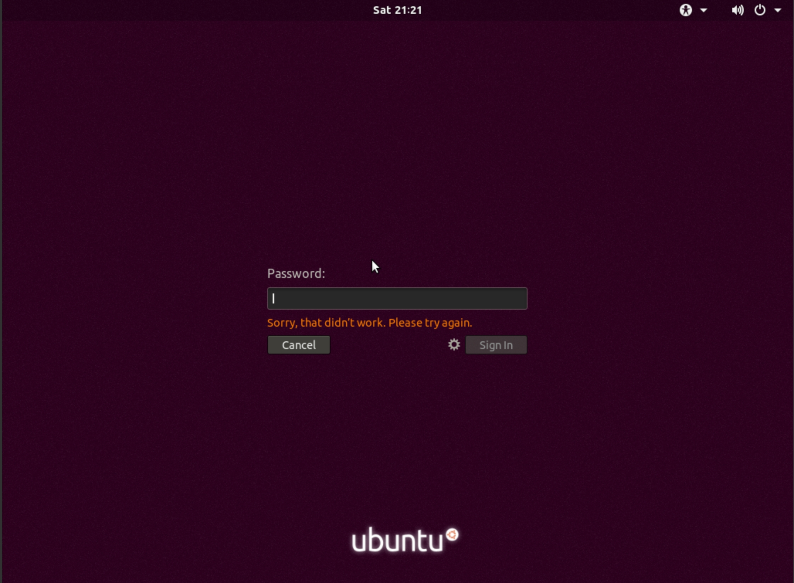

请终端输入 `vim /etc/pam.d/gdm-password` ，然后将配置项的 `user != root` 删除，具体效果如下:<br>

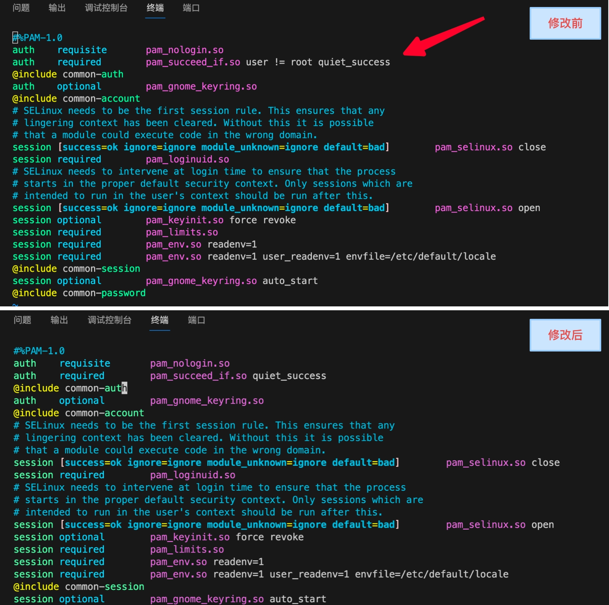

修改后正常关闭文件即可，不需要激活文件或重启实例，现在你应该能够使用VNC登录了。<br>

### 登录后提示"Error found when...":

如果你VNC登录实例后，又遇到了 "Error found when..." ，如下图所示:<br>

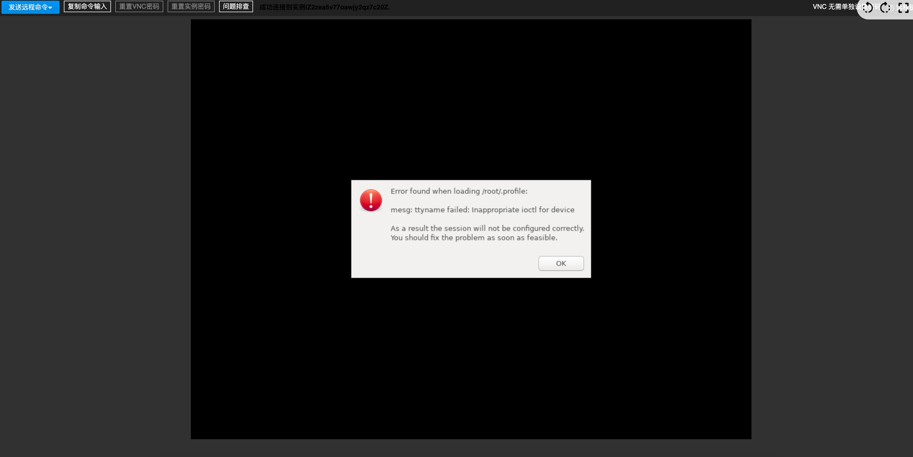

此时需要修改 `/root/.profile` 文件，命令如下:<br>

```bash
vim /root/.profile 
```

将文中的最后一行 `mesg n` 修改成 `tty -s && mesg n`，效果如下:<br>

```bash
tty -s && mesg n || true
```

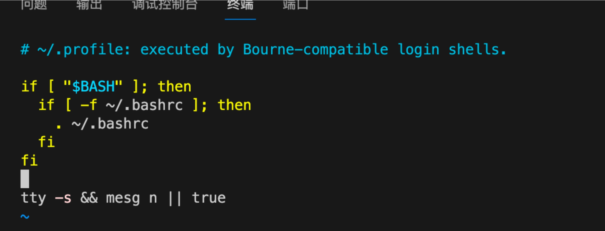

依旧不需要激活文件，尝试重新登录VNC，显示的效果:<br>

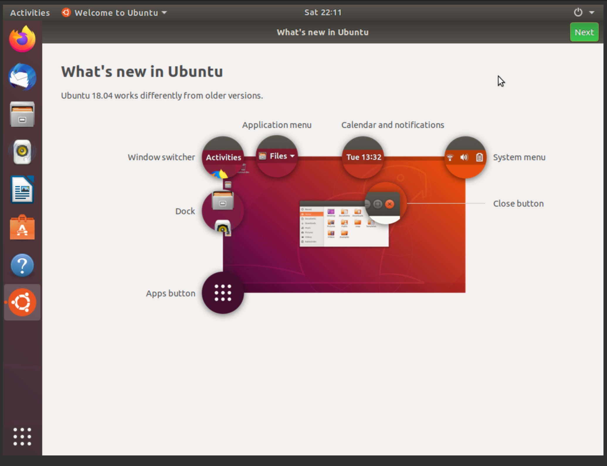

如果出现上图这个界面，就表示ubuntu图形化界面安装成功了。<br>

### 安装monocloud for Linux:

1. 官网下载Linux版安装包，并将文件上传到指定位置，笔者是上传到的桌面，即 `~/Desktop`;

2. 选择 **Extract Here** 将文件解压到当前目录;

3. 双击解压后的文件，然后运行 `cfw` 文件。如果显示无法运行，可以和笔者一样通过终端运行，运行指令如下:<br>

非root用户使用的指令:<br>

```bash
./cfw
```

由于 `cfw` 文件默认不允许以root用户身份启动，需要使用以下指令启动:<br>

```bash
./cfw --no-sandbox
```

4. 程序启动后需要获取Clash链接，具体操作如下:<br>

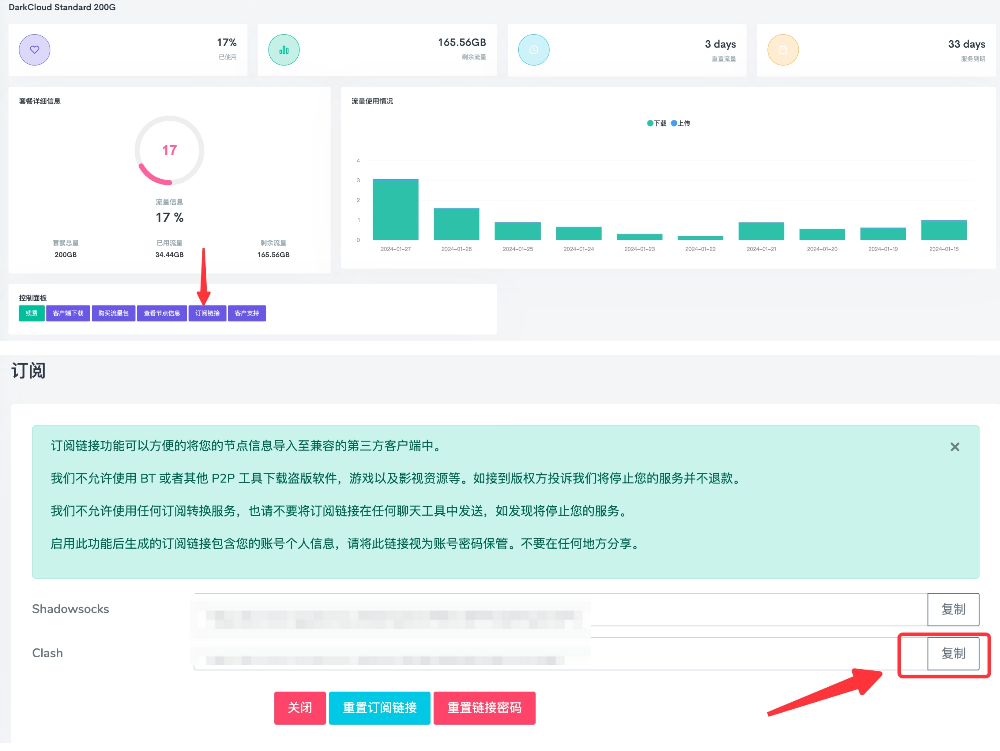

5. monocloud界面中点击 **profiles** 选项，然后将刚刚获取到的Clash链接填入下图所示位置，点击Download，就会在当前界面生成一个新的配置文件，具体操作如下:<br>

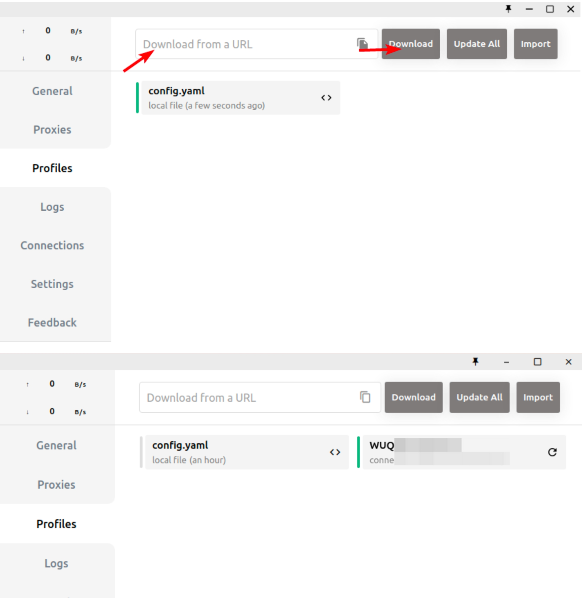

注意，导入成功之后，Profiles 内会显示下载下来的配置文件，并默认选中该配置文件，请在以后使用代理的过程中确保一直使用的是下载下来的配置文件，而不是默认的 config.yaml。<br>

6. 由于monocloud的节点配置可能会根据情况不定时调整，建议在导入 Clash 订阅配置成功之后，右键该配置文件打开“settings”设置，找到 Update Interval 选项设置定时更新订阅配置，如下图:

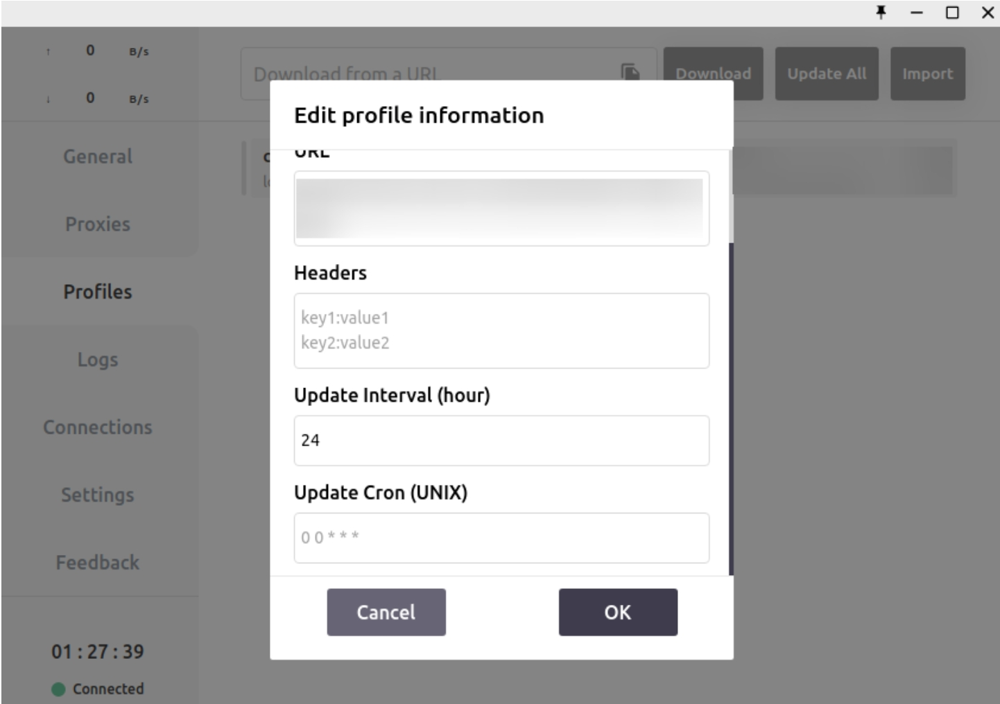

7. 修改网络节点，默认是香港节点，是无法连接openai服务的，需要修改为其他节点，具体操作如下图:

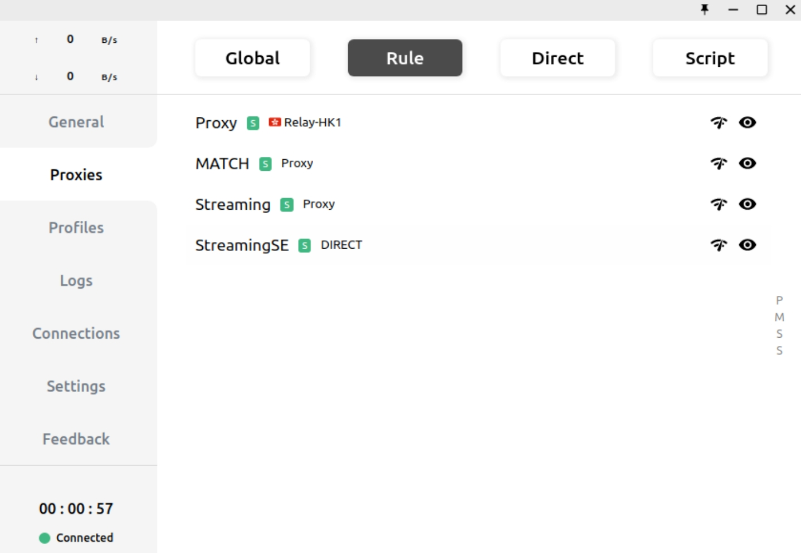

8. 修改ubuntu中的网络设置:

clash for Windows 不会主动修改系统设置，个人需要手动修改系统的网络设置中代理部分设置以便让浏览器等程序可以使用代理进行连接，具体设置可参考下图。如果你跳过此步，后续任何程序（包括浏览器）要使用代理都需要你手动为其添加代理设置。<br>

打开 ubuntu 的 settings，然后按照下图操作:<br>

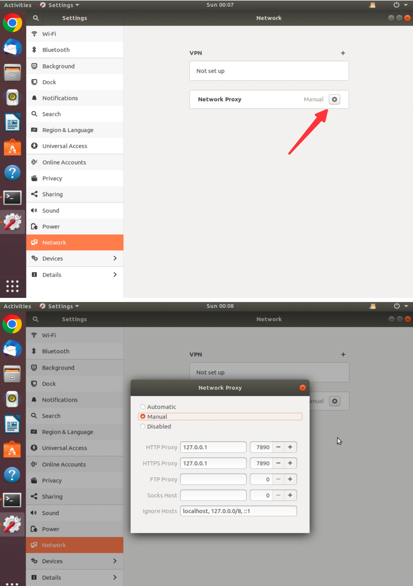

9. 测试科学上网:

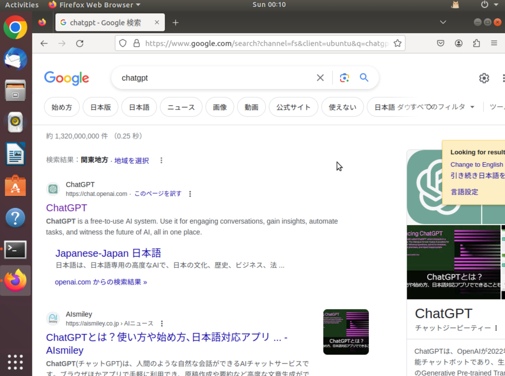

好了，现在浏览器已经能科学上网了。<br>

### 终端科学上网:

假设你已经完成了前面的步骤，现在浏览器已经能科学上网了，我们试着让终端执行代码也科学上网。<br>

#### 临时启用代理:

终端运行以下指令，可以让终端临时使用代理，只要你的终端没有关闭，就可以一直使用代理:<br>

> 两个使用的都是 `"http://127.0..."`，笔者没有写错。

```bash
export http_proxy="http://127.0.0.1:7890"
```

```bash
export https_proxy="http://127.0.0.1:7890"
```

#### 永久使用代理:

要在 Ubuntu 18.04 中永久设置网络代理，你需要将这些 `export` 命令添加到你的个人 shell 启动脚本中。通常，这意味着将它们添加到您的 `~/.bashrc` 或 `~/.profile` 文件中。这样，每次你启动一个新的终端会话时，这些环境变量就会自动设置。<br>

按照以下步骤操作：

1. **打开您的 `~/.bashrc` 或 `~/.profile` 文件：**
   
你可以使用任何文本编辑器打开这个文件。例如，使用 `nano` 编辑器：<br>

```bash
vim ~/.bashrc
```

2. **将代理设置添加到文件末尾：**

在打开的文件中，移动到文件的末尾，然后添加以下行：<br>

```bash
export http_proxy="http://127.0.0.1:7890"
export https_proxy="http://127.0.0.1:7890"
```

3. **保存文件并退出编辑器：**
   
使用的是 `:x` 保存更改并退出编辑器。

4. **应用更改：**

要使更改立即生效，你需要重新加载 `~/.bashrc` 文件。这可以通过在新终端中运行以下命令来实现：<br>

```bash
source ~/.bashrc
```

或者，你可以简单地关闭并重新打开您的终端。<br>

5. **验证设置：**

使用 `echo $http_proxy` 和 `echo $https_proxy` 命令来验证这些环境变量是否被正确设置。<br>

请注意，这些设置只适用于基于 bash shell 的终端会话。如果你使用其他类型的 shell（例如 zsh 或 fish），你可能需要修改不同的配置文件。<br>

> 这些设置不会影响图形用户界面应用程序，如果你需要为 GUI 应用程序设置代理，你可能需要在系统设置中进行配置，也就是上一节的操作。

### 测试代码效果:

笔者的测试代码如下，大家可以使用这份代码测试，也可以使用自己写的代码测试:<br>

```python
"""
@author:ChenPeilong(peilongchencc@163.com)
@description:OpenAI streaming output example code.
"""
import os
from loguru import logger
from dotenv import load_dotenv
from openai import OpenAI

# 加载环境变量
dotenv_path = '.env.local'
load_dotenv(dotenv_path=dotenv_path)

# 设置日志
logger.remove()
logger.add("openai_stream.log", rotation="1 GB", backtrace=True, diagnose=True, format="{time} {level} {message}")


def get_openai_response(chat_history):
    # create openAI client
    client = OpenAI(api_key=os.getenv("OPENAI_API_KEY"))
    # connect openai API server and fetch the response of chat_history with streaming.
    completion = client.chat.completions.create(
        model="gpt-3.5-turbo",
        messages=chat_history,
        stream=True
    )
    # combine the results of streaming output.
    response_content = ""
    for chunk in completion:
        if chunk.choices[0].delta.content is not None:
            print(chunk.choices[0].delta.content, end="")
            response_content += chunk.choices[0].delta.content
    print() # For Line Breaks, Optimizing Terminal Display.
    chat_history.append({"role": "assistant", "content": response_content})
    return chat_history

if __name__ == '__main__':
    # chath_istory can be [], without providing a semantic context(语义环境).
    # chat_history = [{"role": "system", "content": "你是一名NLP算法工程师"}]
    chat_history = []
    while True:
        user_input = input("\nPlease enter your question (type 'exit' to end the program):")
        print() # For Line Breaks, Optimizing Terminal Display.
        # If the user enters 'exit', then terminate the loop.
        if user_input == 'exit':
            break
        
        chat_history.append({"role": "user", "content": user_input})
        # fetch the results of the API response and display them in a streaming manner on the terminal, 
        # while simultaneously(同时) updating chat_history.
        chat_history = get_openai_response(chat_history)
```

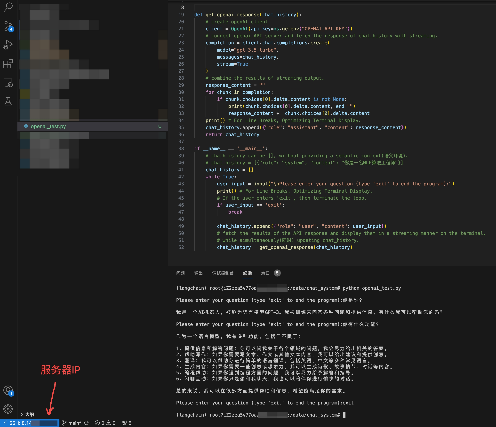

大功告成，可喜可贺～🚀🚀🚀<br>


## 将"ip+port"改为通过域名访问自己的服务:

### 域名购买与实名认证:

笔者购买的是阿里云的域名，具体操作如下，注意创建模板进行实名认证。<br>

~[](./website_domain_purchase.jpg)

实名认证后，需要阿里云审核(非常快)，然后需要注册局审核(大约1～2个小时)。<br>

### 域名解析配置:

登录以下阿里云DNS产品控制台:<br>

```txt
https://dns.console.aliyun.com/?spm=5176.smartservice_service_robot_chat_new.help.12.127b3f1b3EE8rv#/dns/domainList
```

具体操作如下图:<br>

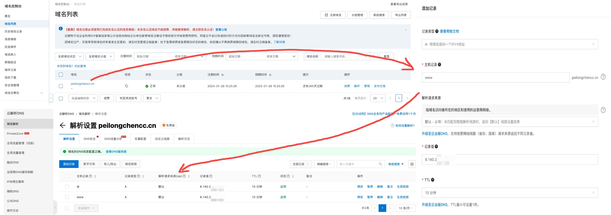

一般对于同一个IP会配 "www" 和 "@" 两种主机记录，即支持用户在网址栏输入 "www.peilongchencc.cn" 和 "peilongchencc.cn" 访问自己的服务。<br>

记录类型要看自己的IP是什么类型，我的公网IP为 `8.140...`，是IPv4，所以选的A记录类型。<br>

### ICP备案:

实名注册域名、管理局审核通过后，还需要进行ICP备案。<br>

注意:ICP备案走的是工信部系统，需要域名实名认证2～3天后才能进行ICP备案。如果你使用的阿里云的域名，可以参考以下网址进行操作:<br>

> 朋友告诉我，ICP备案大概需要一周，不确定，后续有具体结果更新这里的时间。

```txt
https://help.aliyun.com/zh/icp-filing/basic-icp-service/user-guide/for-the-first-time-the-record-process
```

### 服务器开启端口：

需要确保服务器的 80 端口（HTTP）和 443 端口（HTTPS）是开放的，因为这是 web 服务的标准端口。以笔者所用的阿里云服务器为例，，需要在云服务控制面板中配置安全组规则来开放这2个端口。<br>

### 使用 Certbot 正在为指定的域名获取一个(新的) SSL/TLS 证书:

终端运行以下指令，使用 Certbot 正在为指定的域名获取一个(新的) SSL/TLS 证书，注意将域名修改为你自己的域名:<br>

> Certbot获取的SSL证书是免费的，阿里云的SSL证书一年4000¥以上。
> 连接Certbot不需要开通代理，正常网络连接即可。

```bash
sudo certbot certonly --nginx -d www.peilongchencc.cn
```

此时需要注意，如果你的服务器没有打开80和443端口，是无法使用 Cerbot 获取SSL证书的，提示信息如下:<br>

```txt
Saving debug log to /var/log/letsencrypt/letsencrypt.log
Plugins selected: Authenticator nginx, Installer nginx
Obtaining a new certificate
Performing the following challenges:
http-01 challenge for www.peilongchencc.cn
Waiting for verification...
Cleaning up challenges
Failed authorization procedure. www.peilongchencc.cn (http-01): urn:ietf:params:acme:error:connection :: The server could not connect to the client to verify the domain :: 8.140.203.136: Fetching http://www.peilongchencc.cn/.well-known/acme-challenge/yPm_orH_DOox6QVUFBv5jiAiZWH9r8bhFOO-9_T91qk: Timeout during connect (likely firewall problem)

IMPORTANT NOTES:
 - The following errors were reported by the server:

   Domain: www.peilongchencc.cn
   Type:   connection
   Detail: 8.140.203.136: Fetching
   http://www.peilongchencc.cn/.well-known/acme-challenge/yPm_orH_DOox6QVUFBv5jiAiZWH9r8bhFOO-9_T91qk:
   Timeout during connect (likely firewall problem)

   To fix these errors, please make sure that your domain name was
   entered correctly and the DNS A/AAAA record(s) for that domain
   contain(s) the right IP address. Additionally, please check that
   your computer has a publicly routable IP address and that no
   firewalls are preventing the server from communicating with the
   client. If you're using the webroot plugin, you should also verify
   that you are serving files from the webroot path you provided.
```

❤️如果你已经开通了80和443端口，应该会看到以下内容:<br>

```txt
Saving debug log to /var/log/letsencrypt/letsencrypt.log
Plugins selected: Authenticator nginx, Installer nginx
Obtaining a new certificate
Performing the following challenges:
http-01 challenge for www.peilongchencc.cn
Waiting for verification...
Cleaning up challenges

IMPORTANT NOTES:
 - Congratulations! Your certificate and chain have been saved at:
   /etc/letsencrypt/live/www.peilongchencc.cn/fullchain.pem
   Your key file has been saved at:
   /etc/letsencrypt/live/www.peilongchencc.cn/privkey.pem
   Your cert will expire on 2024-04-28. To obtain a new or tweaked
   version of this certificate in the future, simply run certbot
   again. To non-interactively renew *all* of your certificates, run
   "certbot renew"
 - If you like Certbot, please consider supporting our work by:

   Donating to ISRG / Let's Encrypt:   https://letsencrypt.org/donate
   Donating to EFF:                    https://eff.org/donate-le
```

讲下这段信息的关键含义:<br>

新获得的证书和链文件被保存在:<br>

```bash
/etc/letsencrypt/live/www.peilongchencc.cn/fullchain.pem
```

私钥文件保存在: <br>

```bash
/etc/letsencrypt/live/www.peilongchencc.cn/privkey.pem
```

上述信息提到提到证书将在 2024-04-28 过期，建议在未来要更新或修改证书时再次运行 Certbot。也可以使用 `certbot renew` 命令自动更新所有证书。<br>

### 验证SSL证书是否有效(可选):

使用 openssl 命令：在服务器上，你可以使用 openssl 命令行工具来检查 SSL 证书。运行以下命令来检查证书：<br>

```bash
openssl s_client -connect peilongchencc.cn:443 -servername peilongchencc.cn
```

这将连接到你的服务器并显示 SSL 证书的详细信息，包括证书链和任何错误。<br>

### Nginx配置:

#### 安装Nginx:

可以终端输入以下指令，通过检查 Nginx 版本来确定自己电脑中是否有Nginx:<br>

```bash
nginx -v
```

更新的系统信息，然后使用以下指令安装 Nginx:<br>

```bash
sudo apt update
```

```bash
sudo apt upgrade
```

```bash
sudo apt install nginx
```

终端输入以下指令，检查 Nginx 版本:<br>

```bash
nginx -v
```

#### 配置Nginx:

```conf
server {
    listen 80;
    server_name peilongchencc.cn www.peilongchencc.cn;
    
    # 重定向所有 HTTP 请求到 HTTPS
    return 301 https://$host$request_uri;
}

server {
    listen 443 ssl;
    server_name peilongchencc.cn www.peilongchencc.cn;

    # 指定 SSL 证书和私钥路径
    ssl_certificate /etc/letsencrypt/live/www.peilongchencc.cn/fullchain.pem;
    ssl_certificate_key /etc/letsencrypt/live/www.peilongchencc.cn/privkey.pem;

    # 其他 SSL 配置...

    # 代理设置
    location / {
        proxy_pass http://localhost:7860;
        proxy_set_header Host $host;
        proxy_set_header X-Real-IP $remote_addr;
        proxy_set_header X-Forwarded-For $proxy_add_x_forwarded_for;
        proxy_set_header X-Forwarded-Proto $scheme;
    }
}
```

这个配置做了以下几件事情：<br>

监听 80 端口（HTTP）：所有到达 "peilongchencc.cn" 或 "www.peilongchencc.cn" 的 HTTP 请求都会被重定向到 HTTPS。<br>

监听 443 端口（HTTPS）：处理来自 "peilongchencc.cn" 和 "www.peilongchencc.cn" 的 HTTPS 请求。<br>

SSL 证书和密钥：使用 Let's Encrypt 提供的证书和密钥。<br>

代理到本地服务：所有请求都被代理到运行在本机的 7860 端口上的服务。<br>

#### 重定向 HTTP 到 HTTPS（可选）:

Question:<br>

我想要将所有通过 HTTP 访问的流量重定向到 HTTPS，这种情况下我还需要开通服务器的 80 端口吗？<br>

Answer:<br>

即使你打算将所有通过 HTTP 访问的流量重定向到 HTTPS，你仍然需要开放服务器的 80 端口。这是因为初始的 HTTP 请求首先会到达 80 端口，然后才会被服务器重定向到 443 端口（HTTPS）。如果不开放 80 端口，那么初始的 HTTP 请求就无法到达服务器，从而无法完成重定向。<br>

#### 答疑-Nginx配置中哪部分表示了"www"记录？哪部分表示了"@"记录？

在 Nginx 配置中，server_name 指令是用来指定哪些主机名（或域名）由该服务器块处理。在提供的配置示例中，server_name 指令同时涵盖了 "www" 记录和 "@" 记录。让我解释一下：<br>

`server_name peilongchencc.cn www.peilongchencc.cn;` 这行代码的作用是告诉 Nginx，无论是访问 "peilongchencc.cn"（这代表 "@" 记录）还是 "www.peilongchencc.cn"（这代表 "www" 记录），都由这个服务器块处理。<br>

在 Nginx 配置中，并没有专门用来区分 "www" 记录和 "@" 记录的特定部分。server_name 指令可以接受多个域名，这意味着无论用户输入的 URL 中包含 "www" 还是不包含，只要这些域名都在 server_name 指令中列出，Nginx 都会为它们提供服务。<br>

上述Nginx配置能够处理同时指向 "peilongchencc.cn" 和 "www.peilongchencc.cn" 的请求。这样做的好处是无论用户访问哪个版本的域名（无论是带 "www" 还是不带），他们都能够访问到同一个网站。<br>

#### 检查配置文件的语法并重新启动 Nginx:

假定你现在已经按照上述操作将Nginx配置导入了自己的Nginx配置，现在请按照以下步骤执行:<br>

检查配置文件的语法是否正确，使用命令:<br>

```bash
sudo nginx -t
```

如果没有错误，重新启动 Nginx 以应用更改，使用命令:<br>

```bash
sudo systemctl restart nginx
```

完成这些步骤后，且你的ICP备案通过来，用户就可以通过 "https://peilongchencc.cn" 和 "https://www.peilongchencc.cn" 正常访问你的服务了。<br>
