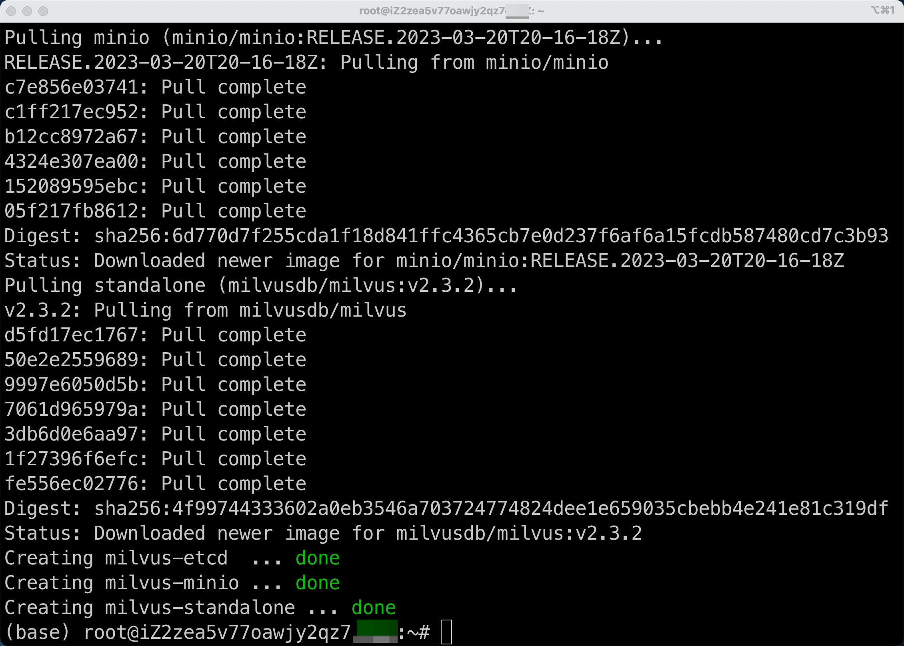
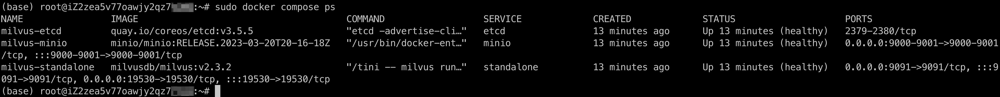

# Milvus
- [Milvus](#milvus)
  - [Milvus安装:](#milvus安装)
  - [查看Milvus版本:](#查看milvus版本)
    - [利用yml文件查看:](#利用yml文件查看)
    - [利用docker查看:](#利用docker查看)
  - [查看Milvus是否运行:](#查看milvus是否运行)
  - [连接Milvus:](#连接milvus)
  - [为Milvus设置密码:](#为milvus设置密码)
  - [更改milvus中数据的存储位置：](#更改milvus中数据的存储位置)
  - [关闭Milvus standalone:](#关闭milvus-standalone)
  - [安装Milvus Python SDK:](#安装milvus-python-sdk)
    - [补充说明Install Milvus Python SDK是什么意思？其中的SDK表示什么:](#补充说明install-milvus-python-sdk是什么意思其中的sdk表示什么)
  - [利用pymilvus与Milvus数据库建立/断开连接:](#利用pymilvus与milvus数据库建立断开连接)
  - [利用pymilvus管理数据库:](#利用pymilvus管理数据库)
    - [创建数据库:](#创建数据库)
    - [查找 Milvus 集群中的所有现有数据库:](#查找-milvus-集群中的所有现有数据库)
    - [使用数据库:](#使用数据库)
    - [删除数据库:](#删除数据库)
  - [Milvus中Schema介绍(集合相关操作):](#milvus中schema介绍集合相关操作)
    - [FieldSchema:](#fieldschema)
    - [DataType:](#datatype)
    - [CollectionSchema:](#collectionschema)
    - [Collection(创建集合):](#collection创建集合)
  - [Partition(分区)和Collection(集合)的关系:](#partition分区和collection集合的关系)
  - [将集合分区(partition):](#将集合分区partition)
    - [查看某个集合的所有分区:](#查看某个集合的所有分区)
    - [在某个集合下创建分区:](#在某个集合下创建分区)
  - [utility介绍:](#utility介绍)
    - [查看Milvus中所有集合](#查看milvus中所有集合)
    - [查看Milvus中是否有某个集合](#查看milvus中是否有某个集合)
    - [删除指定名称的集合：](#删除指定名称的集合)
    - [集合重命名:](#集合重命名)
    - [计算两组向量之间的距离:](#计算两组向量之间的距离)
    - [查看集合属性:](#查看集合属性)
    - [设置/查看集合的过期时间:](#设置查看集合的过期时间)
    - [Milvus能否设置某条数据的过期时间？](#milvus能否设置某条数据的过期时间)
  - [加载/释放集合:](#加载释放集合)
  - [分批向Milvus插入数据:](#分批向milvus插入数据)
  - [pymilvus示例代码:](#pymilvus示例代码)
    - [导入模块和库:](#导入模块和库)
    - [定义格式变量:](#定义格式变量)
    - [定义实体数量和向量维度:](#定义实体数量和向量维度)
    - [连接到Milvus服务器:](#连接到milvus服务器)
    - [检查集合是否存在:](#检查集合是否存在)
    - [定义字段列表:](#定义字段列表)
    - [定义集合的结构:](#定义集合的结构)
    - [创建新的集合:](#创建新的集合)
    - [插入实体:](#插入实体)
    - [创建索引:](#创建索引)
    - [加载集合:](#加载集合)
    - [基于向量相似性的搜索:](#基于向量相似性的搜索)
    - [基于标量过滤的查询:](#基于标量过滤的查询)
    - [分页查询:](#分页查询)
    - [混合搜索:](#混合搜索)
    - [获取插入实体的主键:](#获取插入实体的主键)
    - [构建删除表达式:](#构建删除表达式)
    - [查询并打印删除前的实体:](#查询并打印删除前的实体)
    - [删除实体:](#删除实体)
    - [查询并打印删除后的实体:](#查询并打印删除后的实体)
    - [删除集合:](#删除集合)

## Milvus安装:

1. 选定存放Milvus相关YAML文件的路径:

选择或创建一个文件夹存放Milvus相关YAML文件(文件名为`docker-compose.yml`)，注意将文件夹名称定义为易识别形式，否则时间长后你自己都不知道这个文件是什么。笔者的路径为`/root/`。<br>

2. 下载 YAML 文件;

运行下列指令，会将`docker-compose.yml`下载到当前所在目录:<br>

```bash
wget https://github.com/milvus-io/milvus/releases/download/v2.3.2/milvus-standalone-docker-compose.yml -O docker-compose.yml
```

3. 在` docker-compose.yml` 文件所在目录运行以下命令启动 Milvus:

```bash
sudo docker-compose up -d
```

这个指令的作用是使用 Docker Compose 启动一个由 Docker Compose 配置文件定义的多个容器应用，并且在后台（detached 模式，使用 `-d` 标志）运行这些容器。<br>

  - `docker-compose`: 这是 Docker Compose 工具的命令，它用于管理多个 Docker 容器的部署。Docker Compose 使用一个 YAML 配置文件来定义应用程序的多个服务和它们之间的关系。

  - `up`: 这是 Docker Compose 命令的一个子命令，用于启动定义在配置文件中的服务。当运行 `docker-compose up` 时，它将会创建并启动定义的容器。

  - `-d`: 这是一个选项标志，它告诉 Docker Compose 在后台运行容器。如果不使用 `-d` 标志，Docker Compose 将会在前台显示容器的输出日志，而且如果您关闭终端窗口，容器也会停止。

总的来说，`sudo docker-compose up -d` 命令用于以后台模式启动 Docker Compose 配置文件中定义的容器应用，这些容器应用可以包含多个服务，例如 Web 服务器、数据库等。这个命令对于部署和管理容器化应用程序非常有用。<br>

运行`sudo docker-compose up -d`后，终端显示(官方示例):<br>

```log
Creating milvus-etcd  ... done
Creating milvus-minio ... done
Creating milvus-standalone ... done
```

笔者安装后显示的内容为:<br>




4. 现在检查容器是否已经启动并运行:

```bash
sudo docker compose ps
```

终端显示(官方示例):<br>

```log
      Name                     Command                  State                            Ports
--------------------------------------------------------------------------------------------------------------------
milvus-etcd         etcd -advertise-client-url ...   Up             2379/tcp, 2380/tcp
milvus-minio        /usr/bin/docker-entrypoint ...   Up (healthy)   9000/tcp
milvus-standalone   /tini -- milvus run standalone   Up             0.0.0.0:19530->19530/tcp, 0.0.0.0:9091->9091/tcp
```

笔者安装后显示的内容为:<br>




指令 `sudo docker compose ps` 的作用是列出与当前工作目录下的 `docker-compose.yml` 文件相关的 Docker 服务的状态。<br>

具体来说，这个命令会显示：<br>

- 服务名（service name）
- 命令（command）
- 状态（state，例如 "Up" 或 "Exited"）
- 端口（ports）

使用 `sudo` 前缀是因为 Docker 通常需要超级用户权限来运行。<br>

`docker compose` 是 Docker Compose 的一个新的命令结构，它在 Docker 20.10 之后的版本中被引入。在此之前，通常使用 `docker-compose`（带连字符）的命令格式。两种格式的功能基本相同，但命令结构略有不同。<br>

简而言之，`sudo docker compose ps` 命令用于查看当前目录下由 `docker-compose.yml` 定义的 Docker 服务的状态。<br>

## 查看Milvus版本:

### 利用yml文件查看:

找到你Milvus相关的`docker-compose.yml`文件，文件中会有如下Milvus版本信息:

```yml
  standalone:
    container_name: milvus-standalone
    image: milvusdb/milvus:v2.3.2
```

### 利用docker查看:

终端输入`docker ps`指令后，终端显示(官方示例):<br>

```log
      Name                     Command                  State                            Ports
--------------------------------------------------------------------------------------------------------------------
milvus-etcd         etcd -advertise-client-url ...   Up             2379/tcp, 2380/tcp
milvus-minio        /usr/bin/docker-entrypoint ...   Up (healthy)   9000/tcp
milvus-standalone   /tini -- milvus run standalone   Up             0.0.0.0:19530->19530/tcp, 0.0.0.0:9091->9091/tcp
```

找到自己需要查看的容器名，然后仿照下列指令修改即可:<br>

```bash
docker inspect milvus-standalone | grep "Image" | cut -d '"' -f 4
```

终端显示:<br>

```log
sha256:4b6c62c2b5f8803ec635347be7b430d88a00d1d10226e0cfe6f9a6883ed84ff0
milvusdb/milvus:v2.3.2
```

## 查看Milvus是否运行:

要查看你的 Milvus 是否正在 Ubuntu 18.04 上运行，你可以采用以下几种方法：<br>

1. **使用`docker ps`命令**:
   
如果你是通过 Docker 安装和运行 Milvus 的，你可以使用 `docker ps` 来查看正在运行的容器。例如:<br>

```bash
docker ps
```

在输出的列表中，找是否有 Milvus 的容器正在运行。<br>

2. **使用`ps`命令和`grep`工具**:
   
你可以使用 `ps` 命令结合 `grep` 工具来查看是否有与 Milvus 相关的进程正在运行：<br>

```bash
ps aux | grep milvus
```

如果 Milvus 在运行，你应该能看到与 Milvus 相关的进程信息。<br>

3. **使用`netstat`命令查看端口**:
   
通常，Milvus 默认在 `19530` 端口上监听。你可以使用 `netstat` 来查看此端口是否已经被占用：<br>

```bash
netstat -tuln | grep 19530
```

如果你看到有进程监听在这个端口上，那很可能 Milvus 是在运行的。<br>

或者直接使用`netstat -tuln`查看是否有属于Milvus的端口。<br>

4. **查看 Milvus 的日志**:
   
如果你有访问 Milvus 日志的权限，那么你可以直接查看它的日志来判断其是否在正常运行。<br>

不论你采用哪种方法，记得根据实际情况调整命令和参数。如果你有其他关于 Milvus 或 Ubuntu 的问题，请随时提问。<br>

**如果你是使用 Docker 运行的 Milvus**，Milvus 的日志位置通常在容器内部。你可以使用以下命令来查看 Milvus 容器的日志：<br>

```bash
docker logs [CONTAINER_ID_OR_NAME]
```

其中 `[CONTAINER_ID_OR_NAME]` 是你的 Milvus 容器的 ID 或名称。<br>

如果你是按照笔者的方式安装的Milvus，想查看 Milvus 的日志，可以使用以下命令：<br>

```bash
docker logs milvus-standalone
```

此命令会输出 `milvus-standalone` 容器的日志。<br>

如果需要查看 MinIO 或 etcd 的日志，只需将 `milvus-standalone` 替换为相应的容器名称即可。例如，查看 MinIO 的日志：<br>

```bash
docker logs milvus-minio
```

以上信息应该可以帮助你了解当前 Milvus 的运行状态和查看其日志。<br>


## 连接Milvus:

使用以下指令，验证 Milvus 服务器正在监听哪个本地端口。注意将容器名称替换为你自己的:

```bash
docker port milvus-standalone 19530/tcp
```

终端显示信息:<br>

```log
(base) root@iZ2zea5v77oawjy2qz7cxxx:~# docker port milvus-standalone 19530/tcp
0.0.0.0:19530
[::]:19530
```

这表明，你的 Milvus 容器的 `19530` 端口映射到了宿主机的 `0.0.0.0:19530` 和 `[::]:19530`。<br>

其中：<br>

- `0.0.0.0:19530` 表示该端口在所有的 IPv4 地址上都是可访问的。

- `[::]:19530` 表示该端口在所有的 IPv6 地址上都是可访问的。

这意味着，只要你的服务器防火墙规则允许外部访问这个端口，并且没有其他的网络限制，那么你确实应该可以从外部访问这个 Milvus 实例。<br>

但需要注意的是，对于任何服务，尤其是数据库类服务，直接暴露到外网有其风险。确保你已经设置了适当的安全措施，如防火墙规则、强密码、安全的连接方式等，以保护你的服务不被恶意访问。<br>


## 为Milvus设置密码:


## 更改milvus中数据的存储位置：

更改milvus中数据的存储位置可有效避免因硬盘空间问题引起的Milvus自动关闭，具体操作如下：<br>

1. 找到自己的`docker-compose.yml`文件所在目录，运行以下指令**停止 Milvus 服务**：

```bash
sudo docker-compose down
```

终端显示:<br>

```log
Stopping milvus-minio ... done
Stopping milvus-etcd  ... done
Removing milvus-standalone ... done
Removing milvus-minio      ... done
Removing milvus-etcd       ... done
Removing network milvus
```

2. 查看Milvus中数据存储路径:

打开`docker-compose.yml`文件，查看`standalone`模块对应的`volumes`路径，以笔者为例:<br>

```yml
standalone:
  container_name: milvus-standalone
  image: milvusdb/milvus:v2.3.2
  command: ["milvus", "run", "standalone"]
  security_opt:
  - seccomp:unconfined
  environment:
    ETCD_ENDPOINTS: etcd:2379
    MINIO_ADDRESS: minio:9000
  volumes:
    - ${DOCKER_VOLUME_DIRECTORY:-.}/volumes/milvus:/var/lib/milvus
  healthcheck:
    test: ["CMD", "curl", "-f", "http://localhost:9091/healthz"]
    interval: 30s
    start_period: 90s
    timeout: 20s
    retries: 3
  ports:
    - "19530:19530"
    - "9091:9091"
  depends_on:
    - "etcd"
    - "minio"
```

`docker-compose.yml` 文件中的 `volume` 映射是由 `${DOCKER_VOLUME_DIRECTORY:-.}` 这个环境变量决定的。这意味着如果你没有设定 `DOCKER_VOLUME_DIRECTORY` 这个环境变量，它会默认使用当前目录（`.`）。<br>


1. 迁移数据:

如果 Milvus 已经有数据并且你希望保留，你需要迁移数据到新的目录下，假设要迁移到 `/data/milvus_data` 目录下：<br>

```bash
sudo mv ${DOCKER_VOLUME_DIRECTORY:-.}/volumes/milvus /data/milvus_data
```

空的`/data/milvus_data`将显示以下结构:<br>

```log
(base) root@iZ2zea5v77oawjy2qz7cxxx:/data/milvus_data# tree
.
└── milvus
    ├── rdb_data
    └── rdb_data_meta_kv
```

4. 更新 docker-compose.yml 文件:

在 `standalone` 服务的 `volumes` 部分中，更改映射目录到 `/data/milvus_data`。同时，也建议更改 `etcd` 和 `minio` 的存储路径，以避免未来可能出现的空间问题。<br>

```yml
...
etcd:
  ...
  volumes:
    - /data/etcd_data:/etcd

minio:
  ...
  volumes:
    - /data/minio_data:/minio_data

standalone:
  ...
  volumes:
    - /data/milvus_data:/var/lib/milvus
...
```

5. 再次启动服务：

```bash
sudo docker-compose up -d
```


## 关闭Milvus standalone:

要关闭 `Milvus standalone`，请运行以下指令:<br>

```bash
sudo docker compose down
```

要在停止 Milvus 后删除数据，请运行以下指令:<br>

```bash
sudo rm -rf  volumes
```

## 安装Milvus Python SDK:

切换到你需要安装`pymilvus`的虚拟环境，然后运行以下指令:<br>

```bash
python3 -m pip install pymilvus==2.3.2
```

现在终端运行以下指令，验证下`pymilvus`是否已经正确安装。如果`pymilvus`的安装没有问题，则终端运行以下命令时不会引发异常:<br>

```bash
python3 -c "from pymilvus import Collection"
```

### 补充说明Install Milvus Python SDK是什么意思？其中的SDK表示什么:

"Install Milvus Python SDK" 的意思是安装 Milvus 的 Python 软件开发工具包。<br>

其中的 "SDK" 是 "Software Development Kit" 的缩写，翻译成中文是“软件开发工具包”。<br>

SDK 通常包括一组软件开发工具，这些工具允许开发者为特定的软件包、软件框架、硬件平台、计算机系统、操作系统或平台创建应用程序。<br>

对于 "Milvus Python SDK"，这意味着**这是一个为 Python 语言提供的工具集，允许开发者更容易地与 Milvus 进行交互和开发。**🫠🫠🫠Milvus 是一个开源的向量搜索引擎，它使得大规模向量数据的相似性搜索变得简单高效。<br>

简而言之，如果你想使用 Python 来开发和 Milvus 相关的应用，你就需要安装 Milvus Python SDK。<br>


## 利用pymilvus与Milvus数据库建立/断开连接:

Milvus 支持两个端口，端口`19530`和端口`9091`，端口19530是用于gRPC的，是默认端口。端口9091是用于 RESTful API 的，当你用 HTTP 客户端连接到 Milvus 服务器时使用它。<br>

pymilvus连接Milvus数据库示例:<br>

```python
from pymilvus import connections
connections.connect(
    alias="default",
    user='username',
    password='password',
    host='localhost',
    port='19530'
)
```

`connections.connect()` 方法用于建立全局连接，可以在整个应用程序中共享。**它会自动创建连接池**，并在后续的操作中使用这个连接池来管理连接。<br>

这意味着，一旦使用 `connections.connect()` 建立连接，后续的 Milvus 操作可以共享同一个连接池中的连接，从而提高了性能和资源利用率。<br>

如果你没有对你的Milvus进行账户、密码等配置，可以使用下列写法:<br>

```python
from pymilvus import connections

connections.connect(host='localhost', port='19530')
```

🚨🚨🚨注意: Milvus 支持的最大连接数是 65,536。这个数字指的是客户端与 Milvus 服务器之间的并发连接数量上限。

在同一时间内，最多可以有 65,536 个与 Milvus 服务器的连接处于活动状态。这个连接数限制可以根据你的硬件资源和性能需求进行调整，但在默认配置下，最大连接数是 65,536。

🫠🫠🫠Milvus使用结束后记得断开与Milvus的连接:<br>

```python
connections.disconnect("default")
```


## 利用pymilvus管理数据库:

与传统的数据库引擎类似，你也可以在 Milvus 创建数据库，并为某些用户分配管理数据库的特权。然后，这些用户有权管理数据库中的集合。Milvus 集群最多支持64个数据库。<br>

### 创建数据库:

要创建数据库，首先需要连接到 Milvus 集群并为其准备一个名称，假设你要创建一个名为"book"的database，可以使用以下代码:<br>

```python
from pymilvus import connections, db

conn = connections.connect(host='localhost', port='19530')  # 必须要连接到Milvus才能执行db操作；

database = db.create_database("book")
```

### 查找 Milvus 集群中的所有现有数据库:

```python
from pymilvus import connections, db

conn = connections.connect(host='localhost', port='19530')  # 必须要连接到Milvus才能执行db操作；

# 查找 Milvus 集群中的所有现有数据库
database_name = db.list_database()

print(f"数据库有:{database_name}")
```

终端显示:<br>

```log
数据库有:['default', 'book']
```

Milvus 集群默认只有一个名为"default"的数据库。<br>

### 使用数据库:

Milvus 集群默认只有一个名为"default"的数据库。除非另有说明，否则集合将在默认数据库中创建。<br>

假设你要更改默认数据库，参考以下代码，在连接Milvus的时候设置`db_name`即可。注意将`default`修改为你的数据库名称:<br>

```python

from pymilvus import connections

conn = connections.connect(host="localhost",port="19530",db_name="default")
```

或者依旧使用`db`进行操作:<br>

```python
db.using_database("book")
```

### 删除数据库:

若要删除数据库，必须首先删除其所有集合。否则，删除操作将失败。<br>

```python
db.drop_database("book")

db.list_database()

# Output:
# ['default']
```


## Milvus中Schema介绍(集合相关操作):

Schema指结构，例如表结构、字段构成等。在我们介绍Milvus中Schema的定义方式前，先导入必要的方法，并连接到Milvus数据库:<br>

```python
from pymilvus import connections, FieldSchema, DataType, CollectionSchema, Collection

# 连接Milvus
connections.connect(host='localhost', port='19530')
```

在Milvus中，`CollectionSchema`、`FieldSchema`和`DataType`是创建一个集合(collection)的基本组件。Milvus是一个开源的向量数据库，用于存储和检索大量的向量数据。这三个组件定义了集合的结构和数据类型。<br>

### FieldSchema:

`FieldSchema`用于定义集合中的一个字段(field)的结构。一个字段相当于传统数据库中的一个列(column)。它包括字段的名字、字段的数据类型以及一些额外的参数，比如是否是主键、是否自动创建索引等等。<br>

每个`FieldSchema`对象通常需要至少两个参数：<br>

- 字段名称

- 字段数据类型，这里使用的是`DataType`枚举

示例:<br>

```python
id_field = FieldSchema(name="id", dtype=DataType.INT64, is_primary=True)
vector_field = FieldSchema(name="embedding", dtype=DataType.FLOAT_VECTOR, dim=128)
```

### DataType:

`DataType`是一个枚举类，定义了Milvus中支持的不同数据类型。这些数据类型包括基本的数值类型、字符串和向量类型等。比如，`INT64`用于整数、`FLOAT_VECTOR`用于浮点数向量等。<br>

示例中的`DataType.FLOAT_VECTOR`表示字段是浮点型的向量数据，`dim=128`指的是向量的维度是128。<br>

### CollectionSchema:

`CollectionSchema`定义了整个集合的结构。一个集合可以看作是一张表，其中包含了多个字段。当你创建一个`CollectionSchema`对象时，你需要定义集合中的所有字段，并且可以定义一些关于集合的额外属性，如描述等。<br>

创建`CollectionSchema`对象时，需要将一系列`FieldSchema`对象作为参数传入。<br>

示例:<br>

```python
schema = CollectionSchema(fields=[id_field, vector_field], description="Test collection")
```

这样，使用`CollectionSchema`和`FieldSchema`对象，你可以定义一个Milvus集合的完整结构，`DataType`用于指定字段的数据类型。这种结构化的方式使得Milvus可以灵活地处理不同类型的数据，并且可以对其进行有效的索引和搜索。<br>

### Collection(创建集合):

🚨🚨🚨`CollectionSchema`和`Collection`在Milvus中代表了两个相关但不同的概念：<br>

1. **CollectionSchema**: 

- 这个概念是关于结构定义的。`CollectionSchema`定义了一个集合的结构，包括它包含哪些字段以及这些字段的数据类型。它是创建新集合时的一个蓝图，用于告诉Milvus集合中应该有哪些字段和这些字段的属性（比如数据类型、是否为主键、是否有索引等）。

- `CollectionSchema`不存储任何数据，它只是定义了数据将如何存储的规则。

2. **Collection**:

- `Collection`是基于`CollectionSchema`实际**创建的一个实例**🌿🌿🌿🌿🌿，它是数据存储和检索的容器。你可以向`Collection`中插入数据、对其进行查询和索引操作。一旦根据`CollectionSchema`创建了`Collection`，就可以对其进行这些操作。

- `Collection`实际上存储了数据和索引，你可以认为它是Milvus数据库中的一个“表”。

在实际应用中，首先会定义一个`CollectionSchema`，然后基于这个模式创建一个`Collection`。例如：<br>

```python
from pymilvus import connections, FieldSchema, DataType, CollectionSchema, Collection

# 连接Milvus
connections.connect(host='localhost', port='19530')

# 定义字段
id_field = FieldSchema(name="id", dtype=DataType.INT64, is_primary=True)
vector_field = FieldSchema(name="embedding", dtype=DataType.FLOAT_VECTOR, dim=128)

# 创建集合模式
schema = CollectionSchema(fields=[id_field, vector_field], description="Test collection")

# 使用集合模式创建集合
collection = Collection(name="test_collection", schema=schema)

# 现在你可以向`collection`插入数据，查询数据等
```

在这个例子中，`schema`是一个`CollectionSchema`对象，定义了`collection`应有的结构。创建`collection`时，我们使用这个结构定义，并且给它命名为"test_collection"，这个名字在Milvus中唯一地标识了这个集合。然后，我们可以在这个`collection`上执行各种操作，如插入数据、搜索、更新和删除数据等。<br>

## Partition(分区)和Collection(集合)的关系:

Milvus 是一个开源的向量数据库，用于存储大规模的特征向量，这些向量通常由机器学习模型生成，特别是在进行相似性搜索时。在 Milvus 中，“Collection”和“Partition”是两个核心概念，它们在组织数据时扮演着重要的角色。<br>

- **Collection（集合）**：在 Milvus 中，Collection 类似于传统关系型数据库中的“表（table）”。它是最顶层的数据组织单位，用于存储相同特征的数据。比如，一个 Collection 可以是“用户的脸部特征”，所有的用户脸部特征向量都存储在这个 Collection 中。

- **Partition（分区）**：Partition 是 Collection 下的一个子集💦💦💦，它可以帮助用户更细粒度地管理 Collection 中的数据。通过 Partition，用户可以根据某些特征将数据进一步细分，以优化查询效率。比如，在“用户的脸部特征”这个 Collection 中，我们可以根据地理位置、注册时间等属性为数据创建不同的 Partition。

**举例说明**：<br>

想象一个电商网站的推荐系统，我们要为每个用户保存其浏览商品的特征向量，以便执行相似商品的推荐。<br>

- **Collection**：可以创建一个名为“用户商品浏览特征”的 Collection，所有用户浏览商品的特征向量都将存储在这里。

- **Partitions**：如果电商网站是全球性的，用户遍布世界各地，那么可以根据地区创建 Partition，如“北美区用户”，“欧洲区用户”，“亚洲区用户”等，这样在进行商品推荐时，可以只在用户所在地区的 Partition 中搜索，从而提高搜索效率。<br>

这样的数据组织结构既可以保持数据的管理效率，又可以在执行搜索和其他操作时提高性能。通过合理的设计 Collection 和 Partition，可以在 Milvus 中高效地处理和检索大规模向量数据。<br>

## 将集合分区(partition):

Milvus可以将搜索和其他操作限制在一个分区上，以提高性能。<br>

集合一般由一个或多个分区组成。在创建一个新集合时，Milvus 会自动创建一个默认分区 `_default`。Milvus 中一个集合最多有4096个分区。<br>

### 查看某个集合的所有分区:

```python
from pymilvus import connections, Collection
# 与default Milvus创建连接
connections.connect(host='localhost', port='19530')
# 选择集合
collection = Collection("book")
# 查看该集合的所有分区
print(f"集合book的分区有:{collection.partitions}")
```

终端显示:<br>

```log
集合book的分区有:[{"name":"_default","collection_name":"book","description":""}]
```

### 在某个集合下创建分区:

```python
from pymilvus import connections, Collection
# 与default Milvus创建连接
connections.connect(host='localhost', port='19530')
# 选择集合
collection = Collection("book")
# 在集合中建立分区
collection.create_partition("novel")

# 查看该集合的所有分区
print(f"集合book的分区有:{collection.partitions}")
```

终端显示:<br>

```log
集合book的分区有:[{"name":"_default","collection_name":"book","description":""}, {"name":"novel","collection_name":"book","description":""}]
```

注意:Milvus的集合中，分区不允许重名，如果重复创建相同命名的分区，会引发`PartitionAlreadyExistException: (code=1, message=Partition already exist.)`错误。⛔️⛔️⛔️<br>

## utility介绍:

`pymilvus`中的`utility`模块提供了一组辅助函数，这些函数主要用于执行一些常见的、不直接涉及数据操作的任务。例如，检查集合或分区的存在、重命名集合、获取集合的统计信息等。以下是一些`utility`模块中常用函数的说明和用法：<br>

### 查看Milvus中所有集合

```python
from pymilvus import connections, utility
connections.connect(host='localhost', port='19530')
print(utility.list_collections())   # 返回值为集合名(str)组成的list
```

`list_collections(using='default')`还可以设置数据库名称；<br>

### 查看Milvus中是否有某个集合

```python
from pymilvus import connections, utility
connections.connect(host='localhost', port='19530')
res = utility.has_collection("book")
print(res)  # 如果集合存在，输出True；否则输出False。
```

`has_collection(name, using='default')`：<br>

- `name`：集合的名称。

- `using`：连接的别名。

### 删除指定名称的集合：

```python
from pymilvus import connections, utility
connections.connect(host='localhost', port='19530')
utility.drop_collection("some_collection")
```

`drop_collection(name, using='default')`：<br>

- `name`：要删除的集合的名称。

- `using`：连接的别名。

### 集合重命名:

```python
from pymilvus import connections, utility
connections.connect(host='localhost', port='19530')
utility.rename_collection("old_collection_name", "new_collection_name")
```

`rename_collection(old_name, new_name, timeout=None, using='default')`：<br>

- `timeout`：超时时间（可选）。

- `using`：连接的别名。

### 计算两组向量之间的距离:

```python
from pymilvus import connections, utility
connections.connect(host='localhost', port='19530')
distances = utility.calc_distance([[1, 2]], [[3, 4]], params={"metric": "L2"})
print(distances)  # 输出向量间的距离。
```

`calc_distance(vectors_left, vectors_right, params, timeout=None, using='default')`：

- `vectors_left`和`vectors_right`：两组要计算距离的向量。

- `params`：计算距离时使用的参数，例如距离度量方式。

- `timeout`：超时时间（可选）。

- `using`：连接的别名。

这些辅助函数简化了对Milvus集合的一些常见管理任务的处理，让用户可以更容易地与Milvus集合进行交互。在使用这些函数时，通常需要确保已经通过`connections.connect`与Milvus数据库建立了连接。<br>

### 查看集合属性:

假设你使用了以下代码创建了一个名为`book`的集合:<br>

```python
from pymilvus import Collection, FieldSchema, CollectionSchema, DataType, connections, utility

# 连接Milvus
connections.connect(host='localhost', port='19530')

# 定义集合架构
schema = CollectionSchema(fields=[
    FieldSchema("int64", DataType.INT64, description="int64", is_primary=True),
    FieldSchema("float_vector", DataType.FLOAT_VECTOR, is_primary=False, dim=128),
])

# 架构实例化为一个名为"book"的集合
collection = Collection(name="book", schema=schema)
```

检查默认数据库(`default`)中是否有"book"集合:<br>

```python
from pymilvus import connections, utility

connections.connect(host='localhost', port='19530')
res = utility.has_collection("book")
print(res)  # 没查到会返回False

collections = utility.list_collections()
print(collections)  # 输出所有集合的名称列表。
```

终端显示:<br>

```log
True
['book', 'search_article_in_medium']
```

### 设置/查看集合的过期时间:

设置集合的过期时间(单位为 "秒")需要使用`set_properties`语句，具体操作如下:<br>

```python
from pymilvus import connections, Collection, FieldSchema, CollectionSchema, DataType
# 连接milvus
connections.connect(host='localhost', port='19530')
# 定义字段
fields = [
    FieldSchema("film_id", DataType.INT64, is_primary=True),
    FieldSchema("films", dtype=DataType.FLOAT_VECTOR, dim=128)
    ]
# 定义集合架构
schema = CollectionSchema(fields=fields)
# 利用集合架构实例化一个集合
collection = Collection("test_set_properties", schema)
# 设置集合的过期时间
collection.set_properties({"collection.ttl.seconds": 1200})
```

设置完成后，想要查看是否设置成功，可以运行下列代码:<br>

```python
from pymilvus import connections, Collection, FieldSchema, CollectionSchema, DataType
# 连接milvus
connections.connect(host='localhost', port='19530')
# 选定集合
collection = Collection("test_set_properties")
print(f"the name of collection is :\n{collection.name}\n")
# 获取集合的properties属性
expiration_time = collection.describe().get("properties")
print(f"the expiration time of collection is :\n{expiration_time}\n")
print(f"the format of expiration_time is :\n{type(expiration_time)}\n")

# 将"过期时间"属性转为可操作格式--字符串
expiration_time_string = expiration_time.__str__()
print(expiration_time_string)
print(type(expiration_time_string))
```

终端显示:<br>

```txt
the name of collection is :
test_set_properties

the expiration time of collection is :
[key: "collection.ttl.seconds"
value: "60"
]

the format of expiration_time is :
<class 'google._upb._message.RepeatedCompositeContainer'>

[key: "collection.ttl.seconds"
value: "60"
]
<class 'str'>
```

🐳🐳🐳设置过期时间后查看到的结果，格式比较奇怪🤨🤨🤨，只当作参考，毕竟"过期时间"这个概念是Milvus新添加的功能，可能Milvus还没有彻底完善。<br>

### Milvus能否设置某条数据的过期时间？


## 加载/释放集合:

前面已经介绍过集合的建立了，但偶尔你可能会见到某些代码中出现下列写法:<br>

```python
# 加载集合
collection.release("xxx")

"""你的代码"""

# 释放集合
collection.release("xxx")
```

此时，如果你没有特殊需求，忽略`collection.load()` 和 `collection.release()`即可。<br>

通常情况下，你不需要手动调用 `collection.load()` 和 `collection.release()`，Milvus 将自动管理集合的加载和释放。<br>


## 分批向Milvus插入数据:


## pymilvus示例代码:

```python
# hello_milvus.py 展示了 PyMilvus 的基本操作，PyMilvus 是 Milvus 的 Python SDK。
# 1. 连接到 Milvus
# 2. 创建集合
# 3. 插入数据
# 4. 创建索引
# 5. 在实体上进行搜索、查询和混合搜索
# 6. 通过 PK 删除实体
# 7. 删除集合
import time

import numpy as np
from pymilvus import (
    connections,
    utility,
    FieldSchema, CollectionSchema, DataType,
    Collection,
)

fmt = "\n=== {:30} ===\n"
search_latency_fmt = "搜索延迟 = {:.4f}s"
num_entities, dim = 3000, 8

#################################################################################
# 1. 连接到 Milvus
# 为位于 `localhost:19530` 的 Milvus 服务器添加一个新的连接别名 `default`
# 实际上 "default" 别名在 PyMilvus 中是内置的。
# 如果 Milvus 的地址与 `localhost:19530` 相同，你可以省略所有
# 参数并调用该方法，例如：`connections.connect()`。
#
# 注意: 以下方法的 `using` 参数默认为 "default"。
print(fmt.format("开始连接到 Milvus"))
connections.connect("default", host="localhost", port="19530")

has = utility.has_collection("hello_milvus")
print(f"Milvus 中是否存在 hello_milvus 集合: {has}")

#################################################################################
# 2. 创建集合
# 我们将创建一个包含 3 个字段的集合。
# +-+------------+------------+------------------+------------------------------+
# | | 字段名称   | 字段类型   | 其他属性         |       字段描述                |
# +-+------------+------------+------------------+------------------------------+
# |1|    "pk"    |   VarChar  |  is_primary=True |      "主键字段"               |
# | |            |            |   auto_id=False  |                              |
# +-+------------+------------+------------------+------------------------------+
# |2|  "random"  |    Double  |                  |      "一个 double 字段"       |
# +-+------------+------------+------------------+------------------------------+
# |3|"embeddings"| FloatVector|     dim=8        |  "维度为 8 的 float 向量"     |
# +-+------------+------------+------------------+------------------------------+
fields = [
    FieldSchema(name="pk", dtype=DataType.VARCHAR, is_primary=True, auto_id=False, max_length=100),
    FieldSchema(name="random", dtype=DataType.DOUBLE),
    FieldSchema(name="embeddings", dtype=DataType.FLOAT_VECTOR, dim=dim)
]

schema = CollectionSchema(fields, "hello_milvus 是一个简单的演示，用于介绍 APIs")

print(fmt.format("创建集合 `hello_milvus`"))
hello_milvus = Collection("hello_milvus", schema, consistency_level="Strong")

################################################################################
# 3. 插入数据
# 我们将在 `hello_milvus` 中插入 3000 行数据
# 待插入的数据必须按字段组织。
#
# insert() 方法返回：
# - 如果 schema 中的 auto_id=True，则由 Milvus 自动生成的主键；
# - 如果 schema 中的 auto_id=False，则返回实体中已有的主键字段。

print(fmt.format("开始插入实体"))
rng = np.random.default_rng(seed=19530)
entities = [
    # 提供 pk 字段，因为 `auto_id` 设置为 False
    [str(i) for i in range(num_entities)],
    rng.random(num_entities).tolist(),  # 字段 random，只支持 list
    rng.random((num_entities, dim)),    # 字段 embeddings，支持 numpy.ndarray 和 list
]

insert_result = hello_milvus.insert(entities)

hello_milvus.flush()
print(f"Milvus 中的实体数量: {hello_milvus.num_entities}")  # 检查 num_entities

################################################################################
# 4. 创建索引
# 我们将为 hello_milvus 集合创建一个 IVF_FLAT 索引。
# create_index() 只能应用于 `FloatVector` 和 `BinaryVector` 字段。
print(fmt.format("开始创建 IVF_FLAT 索引"))
index = {
    "index_type": "IVF_FLAT",
    "metric_type": "L2",
    "params": {"nlist": 128},
}

hello_milvus.create_index("embeddings", index)

################################################################################
# 5. 搜索、查询和混合搜索
# 数据被插入到 Milvus 并进行索引后，你可以执行：
# - 基于向量相似性的搜索
# - 基于标量筛选（布尔值、整数等）的查询
# - 基于向量相似性和标量筛选的混合搜索。
#

# 在进行搜索或查询之前，你需要将 `hello_milvus` 中的数据加载到内存中。
print(fmt.format("开始加载数据"))
hello_milvus.load()

# -----------------------------------------------------------------------------
# 基于向量相似性的搜索
print(fmt.format("开始基于向量相似性的搜索"))
vectors_to_search = entities[-1][-2:]
search_params = {
    "metric_type": "L2",
    "params": {"nprobe": 10},
}

start_time = time.time()
result = hello_milvus.search(vectors_to_search, "embeddings", search_params, limit=3, output_fields=["random"])
end_time = time.time()

for hits in result:
    for hit in hits:
        print(f"命中: {hit}, random 字段: {hit.entity.get('random')}")
print(search_latency_fmt.format(end_time - start_time))

# -----------------------------------------------------------------------------
# 基于标量筛选（布尔值、整数等）的查询
print(fmt.format("开始使用 `random > 0.5` 进行查询"))

start_time = time.time()
result = hello_milvus.query(expr="random > 0.5", output_fields=["random", "embeddings"])
end_time = time.time()

print(f"查询结果:\n-{result[0]}")
print(search_latency_fmt.format(end_time - start_time))

# -----------------------------------------------------------------------------
# 分页
r1 = hello_milvus.query(expr="random > 0.5", limit=4, output_fields=["random"])
r2 = hello_milvus.query(expr="random > 0.5", offset=1, limit=3, output_fields=["random"])
print(f"查询分页(limit=4):\n\t{r1}")
print(f"查询分页(offset=1, limit=3):\n\t{r2}")

# -----------------------------------------------------------------------------
# 混合搜索
print(fmt.format("开始使用 `random > 0.5` 进行混合搜索"))

start_time = time.time()
result = hello_milvus.search(vectors_to_search, "embeddings", search_params, limit=3, expr="random > 0.5", output_fields=["random"])
end_time = time.time()

for hits in result:
    for hit in hits:
        print(f"命中: {hit}, random 字段: {hit.entity.get('random')}")
print(search_latency_fmt.format(end_time - start_time))

###############################################################################
# 6. 通过 PK 删除实体
# 你可以使用布尔表达式通过它们的 PK 值删除实体。
ids = insert_result.primary_keys

expr = f'pk in ["{ids[0]}" , "{ids[1]}"]'
print(fmt.format(f"开始使用表达式 `{expr}` 进行删除"))

result = hello_milvus.query(expr=expr, output_fields=["random", "embeddings"])
print(f"使用表达式=`{expr}` 查询删除前的结果 -> 结果: \n-{result[0]}\n-{result[1]}\n")

hello_milvus.delete(expr)

result = hello_milvus.query(expr=expr, output_fields=["random", "embeddings"])
print(f"使用表达式=`{expr}` 查询删除后的结果 -> 结果: {result}\n")

###############################################################################
# 7. 删除集合
# 最后，删除 hello_milvus 集合
print(fmt.format("删除集合 `hello_milvus`"))
utility.drop_collection("hello_milvus")
```

接下来详细解释上述代码各部分的作用：<br>

### 导入模块和库:

```python
import time
import numpy as np
from pymilvus import (
      connections,
      utility,
      FieldSchema, CollectionSchema, DataType,
      Collection,
)
```

- `time`: Python的标准库，用于处理时间。

- `numpy as np`: 一个用于大量数据计算的Python库。

- `pymilvus`: Milvus的Python客户端，用于与Milvus服务器进行交互。

### 定义格式变量:

```python
fmt = "\n=== {:30} ===\n"
search_latency_fmt = "search latency = {:.4f}s"
```

- `fmt`和`search_latency_fmt`是字符串格式模板，用于后面的输出。

### 定义实体数量和向量维度:

```python
num_entities, dim = 3000, 8
```

- `num_entities`：代表实体的数量，这里设置为3000。

- `dim`：代表向量的维度，这里设置为8。

### 连接到Milvus服务器:

```python
print(fmt.format("start connecting to Milvus"))
connections.connect("default", host="localhost", port="19530")
```

- 使用`fmt.format("start connecting to Milvus")`格式化并打印连接开始信息。

- `connections.connect()`用于连接到Milvus服务器，参数`"default"`是连接的别名，`host="localhost"`指定了服务器地址，`port="19530"`指定了服务器端口。

### 检查集合是否存在:

```python
has = utility.has_collection("hello_milvus")
print(f"Does collection hello_milvus exist in Milvus: {has}")
```

- `utility.has_collection("hello_milvus")`：检查名为"hello_milvus"的集合是否在Milvus中存在。

- 使用f-string打印查询结果。

**通过这段代码，可以学到如何使用pymilvus库连接到Milvus服务器并简单地检查一个集合是否存在。**<br>

### 定义字段列表:

```python
fields = [
      FieldSchema(name="pk", dtype=DataType.VARCHAR, is_primary=True, auto_id=False, max_length=100),
      FieldSchema(name="random", dtype=DataType.DOUBLE),
      FieldSchema(name="embeddings", dtype=DataType.FLOAT_VECTOR, dim=dim)
]
```

这里定义了三个字段：<br>

- `pk`：一个VARCHAR类型的字段，作为主键（`is_primary=True`）。该字段不会自动生成ID（`auto_id=False`），并且最大长度为100（`max_length=100`）。

- `random`：一个DOUBLE类型的字段，用于存储浮点数。

- `embeddings`：一个FLOAT_VECTOR类型的字段，用于存储浮点数向量。向量的维度由之前的代码中定义的`dim`变量决定。

### 定义集合的结构:

```python
schema = CollectionSchema(fields, "hello_milvus is the simplest demo to introduce the APIs")
```

`CollectionSchema`函数用于定义一个集合的结构，它接受两个参数：<br>

- `fields`：一个字段列表，定义了集合中的数据结构。

- 描述：一个描述该集合的字符串。

### 创建新的集合:

```python
print(fmt.format("Create collection `hello_milvus`"))
hello_milvus = Collection("hello_milvus", schema, consistency_level="Strong")
```

- 使用`fmt.format("Create collection `hello_milvus`")`格式化并打印创建集合的开始信息。

- `Collection`函数用于在Milvus中创建新的集合。它接受三个参数：

    - 集合的名称，这里是`"hello_milvus"`。
    
    - 之前定义的`schema`，即集合的结构。
    
    - `consistency_level`参数，这里设置为`"Strong"`，这意味着Milvus会确保写操作的一致性。

**经过这段代码，我们可以学到如何使用`pymilvus`库定义集合的结构，并在Milvus中创建一个新的集合。**<br>


### 插入实体:

```python
print(fmt.format("Start inserting entities"))
rng = np.random.default_rng(seed=19530)
entities = [
      [str(i) for i in range(num_entities)],
      rng.random(num_entities).tolist(),
      rng.random((num_entities, dim)),
]
```

- 使用`fmt.format("Start inserting entities")`格式化并打印插入实体的开始信息。

- `rng = np.random.default_rng(seed=19530)`：创建一个随机数生成器。`seed=19530`确保每次运行时都可以得到相同的随机数。

- `entities`是一个列表，其中包含三个子列表/数组，分别对应于之前定义的三个字段。

    - 第一个列表：主键字段的值。因为`auto_id`之前设置为`False`，所以需要为每个实体提供一个唯一的主键。

    - 第二个列表：`random`字段的值。使用随机数生成器为每个实体生成一个随机浮点数。
      
    - 第三个数组：`embeddings`字段的值。使用随机数生成器为每个实体生成一个随机浮点数向量。

```python
insert_result = hello_milvus.insert(entities)
```

- 使用`insert`方法将`entities`插入到`hello_milvus`集合中。

```python
hello_milvus.flush()
print(f"Number of entities in Milvus: {hello_milvus.num_entities}")
```

- `hello_milvus.flush()`：确保所有的插入操作都已提交到Milvus。

- 打印`hello_milvus`集合中的实体数量，以确认插入操作成功。

### 创建索引:

```python
print(fmt.format("Start Creating index IVF_FLAT"))
index = {
      "index_type": "IVF_FLAT",
      "metric_type": "L2",
      "params": {"nlist": 128},
}
```

- 使用`fmt.format("Start Creating index IVF_FLAT")`格式化并打印创建索引的开始信息。

- 定义索引参数。这里选择了`IVF_FLAT`索引类型，它适用于浮点数向量。`metric_type`为`L2`，表示使用L2距离来测量向量之间的相似性。`params`指定了索引的额外参数，这里设置`nlist`为128。

```python
hello_milvus.create_index("embeddings", index)
```

- 使用`create_index`方法为`embeddings`字段创建索引。这使得向量搜索操作更快、更高效。

总结，这段代码首先向Milvus的`hello_milvus`集合插入随机生成的实体，然后为`embeddings`字段创建一个`IVF_FLAT`索引，以加速向量搜索操作。<br>


### 加载集合:

```python
print(fmt.format("Start loading"))
hello_milvus.load()
```

在执行查询或搜索之前，需要先加载集合到内存中，使其准备好进行搜索。<br>

### 基于向量相似性的搜索:

```python
print(fmt.format("Start searching based on vector similarity"))
vectors_to_search = entities[-1][-2:]
search_params = {
      "metric_type": "L2",
      "params": {"nprobe": 10},
}
```

- 选择要搜索的向量。这里选择了之前插入的最后两个向量作为查询。

- 定义搜索参数。`metric_type`为`L2`，表示使用L2距离。`params`字典中的`nprobe`参数决定了搜索时考虑的桶数量。

```python
start_time = time.time()
result = hello_milvus.search(vectors_to_search, "embeddings", search_params, limit=3, output_fields=["random"])
end_time = time.time()
```

- 记录搜索开始时间。

- 使用`search`方法搜索最相似的向量。`limit=3`表示为每个查询向量返回3个最相似的结果。

- 记录搜索结束时间。

```python
for hits in result:
      for hit in hits:
      print(f"hit: {hit}, random field: {hit.entity.get('random')}")
print(search_latency_fmt.format(end_time - start_time))
```

- 输出搜索结果和每个结果的`random`字段的值。

- 打印搜索所用的时间。

### 基于标量过滤的查询:

```python
print(fmt.format("Start querying with `random > 0.5`"))
start_time = time.time()
result = hello_milvus.query(expr="random > 0.5", output_fields=["random", "embeddings"])
end_time = time.time()
```

- 使用表达式`random > 0.5`进行查询，意味着查询`random`字段值大于0.5的所有实体。

- 打印查询结果和查询所用的时间。

### 分页查询:

```python
r1 = hello_milvus.query(expr="random > 0.5", limit=4, output_fields=["random"])
r2 = hello_milvus.query(expr="random > 0.5", offset=1, limit=3, output_fields=["random"])
```

- 进行两次查询，第一次返回最多4个结果，第二次跳过第一个结果并返回最多3个结果。

### 混合搜索:

```python
print(fmt.format("Start hybrid searching with `random > 0.5`"))
start_time = time.time()
result = hello_milvus.search(vectors_to_search, "embeddings", search_params, limit=3, expr="random > 0.5", output_fields=["random"])
end_time = time.time()
```

- 同时考虑向量相似性和标量过滤条件进行搜索。

- 打印搜索结果和搜索所用的时间。

总结：这段代码展示了如何使用`pymilvus`库进行基于向量相似性的搜索、基于标量过滤的查询、分页查询和混合搜索。<br>

### 获取插入实体的主键:

```python
ids = insert_result.primary_keys
```

- 从之前的插入操作中获取插入实体的主键。这些主键是唯一的，并用于标识插入的实体。

### 构建删除表达式:

```python
expr = f'pk in ["{ids[0]}" , "{ids[1]}"]'
print(fmt.format(f"Start deleting with expr `{expr}`"))
```

- 构建一个表达式，该表达式表示要删除的实体的主键。在这里，我们选择删除插入实体的前两个。

- 打印开始删除的消息。

### 查询并打印删除前的实体:

```python
result = hello_milvus.query(expr=expr, output_fields=["random", "embeddings"])
print(f"query before delete by expr=`{expr}` -> result: \n-{result[0]}\n-{result[1]}\n")
```

- 使用上面构建的表达式查询这两个实体，以确认它们存在于集合中。

- 打印这两个实体的详细信息。

### 删除实体:

```python
hello_milvus.delete(expr)
```

- 调用`delete`方法删除匹配表达式的实体。

### 查询并打印删除后的实体:

```python
result = hello_milvus.query(expr=expr, output_fields=["random", "embeddings"])
print(f"query after delete by expr=`{expr}` -> result: {result}\n")
```

- 使用相同的表达式再次查询这两个实体，以确认它们已从集合中被删除。

- 打印查询结果。由于实体已被删除，因此结果应该是空的。

### 删除集合:

```python
print(fmt.format("Drop collection `hello_milvus`"))
utility.drop_collection("hello_milvus")
```

- 打印开始删除集合的消息。

- 调用`drop_collection`方法删除整个`hello_milvus`集合。

总之，这段代码首先删除了`hello_milvus`集合中的两个实体，然后删除整个`hello_milvus`集合。<br>