# doccano
doccano 是一个开源的文本标注工具，用于人工标注。它提供了用于文本分类、序列标注和序列到序列任务的标注功能。用户可以创建带有情感分析、命名实体识别、文本摘要等标签的数据。只需创建一个项目、上传数据，然后开始进行标注。用户可以在几小时内构建一个数据集。<br>

doccano的github链接如下:<br>

```txt
https://github.com/doccano/doccano
```

doccano《使用手册》链接如下:<br>

```txt
https://doccano.github.io/doccano/
```

- [doccano](#doccano)
  - [启动doccano:](#启动doccano)
    - [doccano特点：](#doccano特点)
    - [doccano的python要求：](#doccano的python要求)
    - [doccano安装并启动：](#doccano安装并启动)
  - [网页登录:](#网页登录)
  - [创建项目:](#创建项目)
  - [导入数据集:](#导入数据集)
  - [建立标签和关系:](#建立标签和关系)
  - [标注数据:](#标注数据)
  - [导出文件：](#导出文件)
  - [代码读取jsonl文件，构建三元组:](#代码读取jsonl文件构建三元组)
  - [多人协作:](#多人协作)
  - [任务分配:](#任务分配)

## 启动doccano:

### doccano特点：
- Collaborative annotation（协作标注）
- Multi-language support（多语言支持）
- Mobile support（移动端支持）
- Emoji 😄 support（表情符号支持）
- Dark theme（暗黑主题）
- RESTful API

### doccano的python要求：

pip (Python 3.8+)<br>

### doccano安装并启动：

假设你使用的conda，可通过以下指令创建名为doccano的虚拟环境，并安装最新版python。<br>

```bash
# 创建名为doccano的虚拟环境，并安装最新版python
conda create -n doccano python
```

如果要使用指定版本的python，可使用以下指令:<br>

```bash
conda create -n doccano python=3.10.11
```

激活虚拟环境:<br>

```bash
conda activate doccano
```

以pip的方式安装doccano:<br>

```shell
pip install doccano
```

如果你使用 `pip install doccano` 指令在安装doccano时报了如下错误：<br>

```shell
Preparing metadata (setup.py) ... error
error: subprocess-exited-with-error
```

运行以下指令即可：<br>

```shell
pip install setuptools-scm
pip install doccano
```

安装后，终端运行以下命令：<br>

```shell
# Initialize database.(初始化数据库)
doccano init
# Create a super user.(创建一个超级管理员，"admin"和"pass"修改为自己的账户名和密码，也可以不修改直接使用下列指令。)
doccano createuser --username admin --password pass
# Start a web server.(启动端口号为8000的web服务)
doccano webserver --port 8000
```

如果端口号8000和你系统的端口号产生了冲突，可以直接通过类似以下指令修改端口，再次启动doccano:<br>

```bash
doccano webserver --port 8008
```

🚨🚨🚨另开一个终端，运行下列指令。只有运行了下列指令doccano才支持文件的上传和下载：<br>

```shell
# Start the task queue to handle file upload/download.
doccano task
```

如果执行 `doccano task` 显示 `pydantic:ConstrainedStr has been removed in V2`，将 `pydantic` 降级到1.8版本就好了。<br>


## 网页登录:

运行 `doccano webserver --port 8000` 后终端会提示你doccano的访问链接，例如:<br>

```txt
http://127.0.0.1:8000/
```

如果你是服务器启动的doccano，访问方式为 `http://{your_public_ip}:8000/` ，例如:<br>

```txt
http://8.140.203.xxx:8000
```

🚨🚨🚨注意：服务器启动的doccano一定要开启对应的公网端口，否则无法访问启动的服务。<br>

浏览器输入上述网址后，你应该已经进入了doccano的主页。此时点击界面右上角的 "Log in" ，然后输入账号和密码即可登录。<br>

如果你是使用 `doccano createuser --username admin --password pass` 创建的账号和密码，则账号为 `admin` ，密码为 `pass` 。<br>


## 创建项目:

以NER任务为例，创建项目的具体流程如下:<br>

1. Project 界面点击 "Create" 按钮；

2. 选择 "Sequence Labeling"，即序列标注；

3. 输入 "Project name"、"Description"、"Tags"，注意 "Tags" 的分割方式后，输入内容后回车即组成一个Tag，然后继续输入内容，再次回车，会添加一个新的Tag；

4. 自己决定是否勾选 "Allow project members to create label types"，即允许团队成员创建标签；

5. 勾选 "Allow overlapping spans"，即允许重叠；

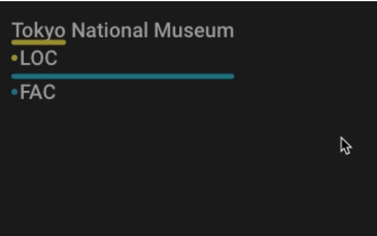

6. 勾选 "use relation labeling"，即使用关系标记；

7. 自己决定是否勾选 "count grapheme clusters as one character"（将不同语言的最小语言单位计为一个字符），处理复合语言会用到。如果你的项目不涉及使用复合字符的语言（如某些印度语系语言、泰语等），或者不需要特别关注如表情符号这样的特殊字符表示，你可能不需要勾选这个选项。

8. 自己决定是否勾选 "Randomize document order"，即文档随机排序；

9. 自己决定是否勾选 "Share annotations across all users"，即在所有用户共享标注。<br>

"在所有用户共享标注":<br>

- **勾选“在所有用户共享标注”**：这意味着项目中的所有标注员可以看到其他人的标注结果。这个选项对于一些特定的应用场景是有用的，比如当您需要多个标注员对同一数据集进行审查或者需要他们在彼此的工作基础上进行进一步的标注时。这有助于保持标注结果的一致性，并可以作为质量控制的一种形式，让标注员之间能够验证和改进彼此的标注。

- **不勾选“在所有用户共享标注”**：这意味着每个标注员只能看到并标注自己的任务分配，看不到其他标注员的标注结果。这适用于您希望独立收集多个标注员对同一数据集的标注结果，以便之后比较和合并这些结果，或者在标注任务需要保持独立性和盲审的情境下。

笔者是这几项全部勾选的，图示如下:<br>

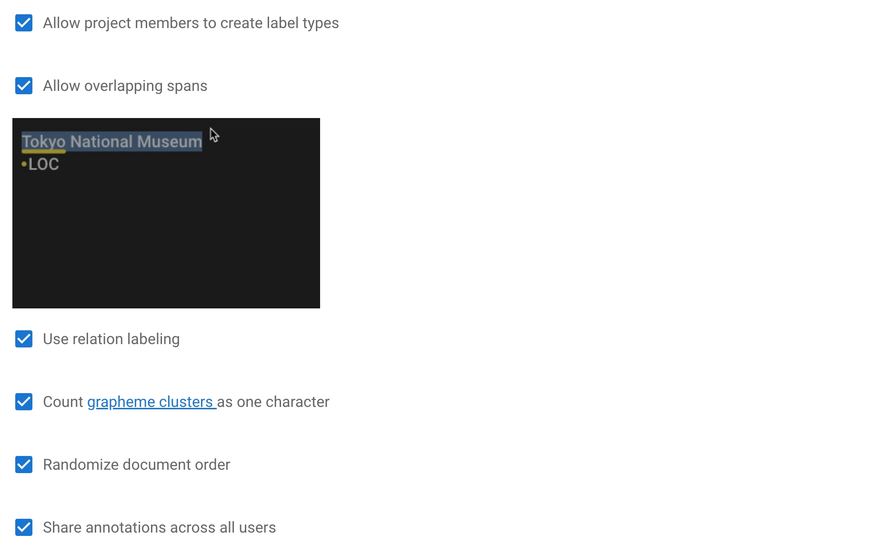

10. 点击 "create" 创建项目。

此时项目已经创建成功了，你可以开始导入数据集了。<br>


## 导入数据集:

在导入数据集之前，先确保你已经开启了doccano的文件上传与下载功能，即另开了一个终端运行 `doccano task`。<br>

doccano的文件上传与下载功能开启后，点击左侧菜单栏的 "Dataset" ，然后点击 "Actions"，选择 "Import Dataset"。<br>

doccano支持多种数据导入方式，笔者推荐的是 **"TextLine"** 方式。<br>

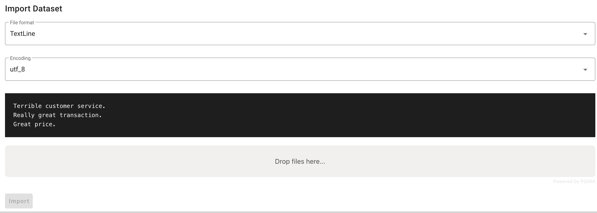

上传的文件格式依旧为txt，但要注意内容为每一条数据占据一行，例如:<br>

```txt
《战争与和平》是托尔斯泰的杰作之一。
《指环王》系列由彼得·杰克逊导演。
钢铁侠是漫威宇宙中的一个超级英雄。
伊丽莎白二世是英国的女王。
```

上传完成后，点击 "Import" 即可，doccano会帮你自动按行分割数据，效果如下:<br>

> 图片中数据的顺序是随机的，这是因为笔者在创建项目时勾选了 "Randomize document order"，即文档随机排序；

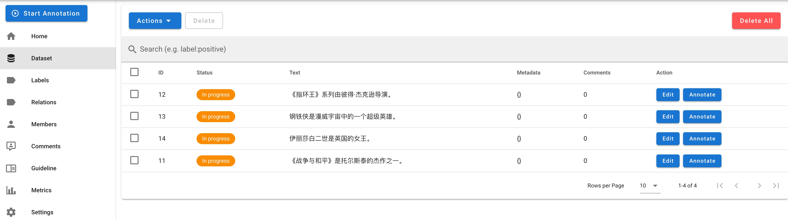


## 建立标签和关系:

🚨🚨🚨声明:由于doccano本身的缘故，左侧菜单栏的 "Relations" 按钮点击会报错。这个并不影响doccano本身的使用，因为 "Relation" 功能被包含在了 "Labels" 模块中。<br>

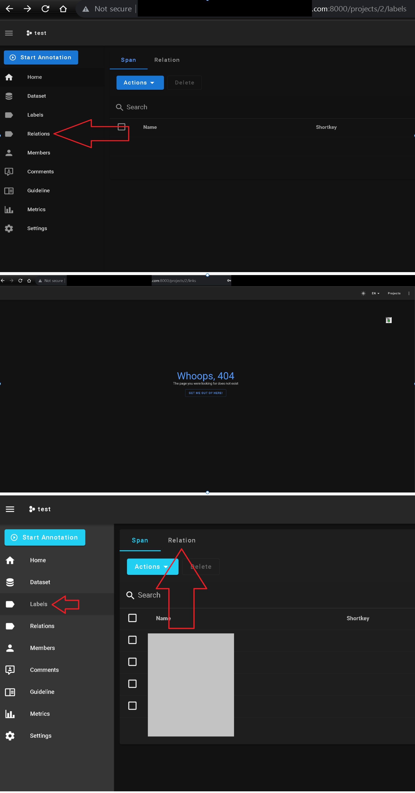

创建labels和relations很简单，没什么可讲的，具体可参考下图:<br>

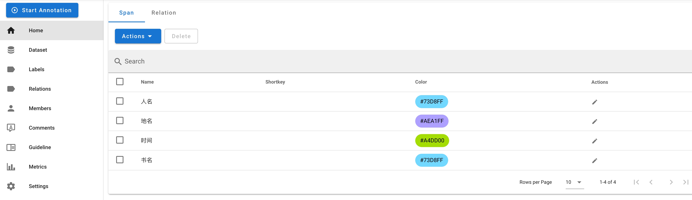


## 标注数据:

标签和关系创建好后，点击 "Dataset" 返回数据集界面。选择你要标注的数据，点击 "Annotate"(标注) 即可开始标注数据。具体标注方式可参考下图:<br>

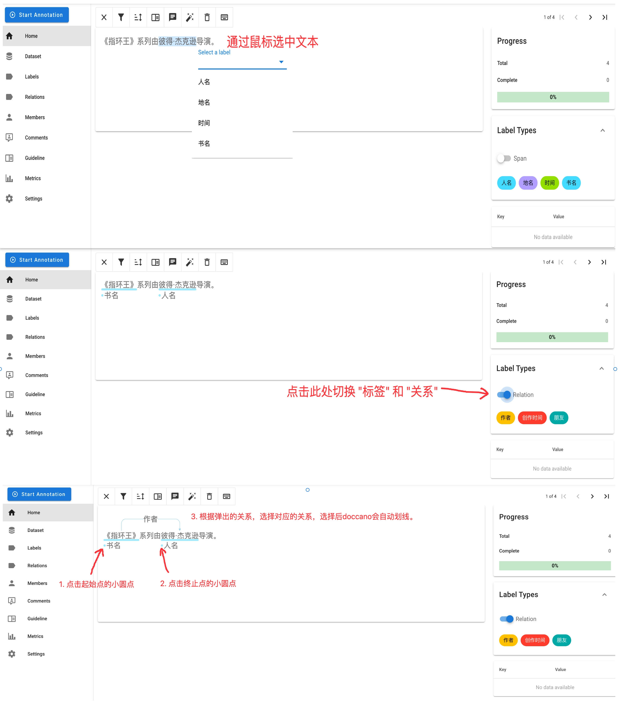

注意: 当点击标签或关系后，每次选中内容会自动执行标注操作，不再有选项。相当于快速标注，示意图如下:<br>

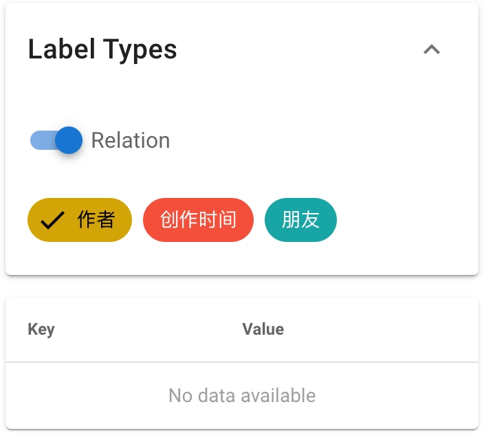

数据标注好后，可参考下图操作，区分 "完成" 与 "进行中" 的任务:<br>

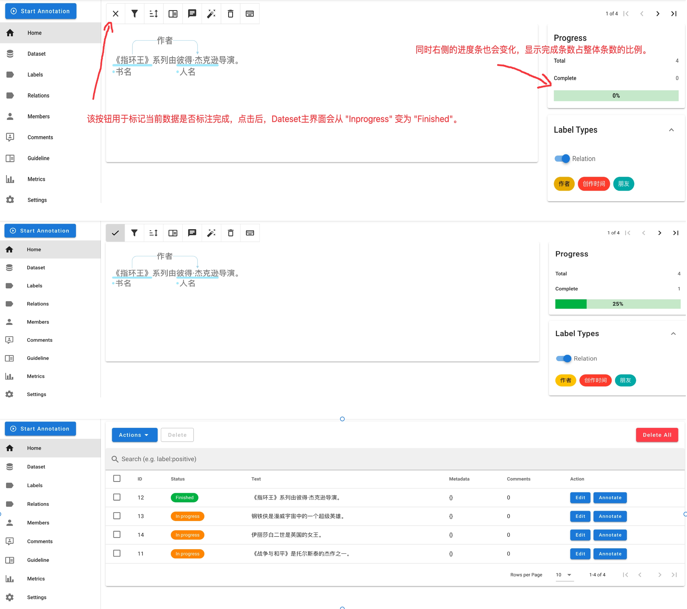


## 导出文件：

doccano 导出的 JSONL 文件中，每个实体和关系都有一个独特的 id 作为标识符。这些 id 是由 doccano 在标注数据的过程中自动生成的，**它们不一定按照顺序排列或者是连续的**。因此，你看到的id可能会出现乱序的情况，这并不影响数据的正确性和使用。<br>

选择需要的数据，然后点击 "Export Dataset"，"File format" 选择 "JSONL" (暂时doccano只提供了JSONL这一种导出方式)，看个人需求勾选 "Export only approved documents" ，然后点击 "Export" 即可将文件下载到本地(zip格式，需要解压):<br>

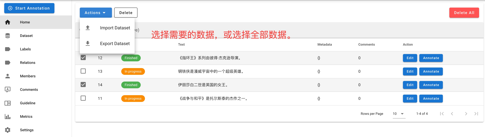

勾选 "Export only approved documents" (仅导出已审核的文档)，效果如下:<br>

```jsonl
{"id":12,"text":"《指环王》系列由彼得·杰克逊导演。","entities":[{"id":29,"label":"人名","start_offset":8,"end_offset":14},{"id":30,"label":"书名","start_offset":0,"end_offset":5}],"relations":[{"id":15,"from_id":30,"to_id":29,"type":"作者"}],"Comments":[]}
{"id":14,"text":"伊丽莎白二世是英国的女王。","entities":[{"id":31,"label":"人名","start_offset":0,"end_offset":6},{"id":32,"label":"地名","start_offset":7,"end_offset":9}],"relations":[],"Comments":[]}
```

不勾选 "Export only approved documents" (仅导出已审核的文档)，效果如下:<br>

```jsonl
{"id":11,"text":"《战争与和平》是托尔斯泰的杰作之一。","entities":[],"relations":[],"Comments":[]}
{"id":12,"text":"《指环王》系列由彼得·杰克逊导演。","entities":[{"id":29,"label":"人名","start_offset":8,"end_offset":14},{"id":30,"label":"书名","start_offset":0,"end_offset":5}],"relations":[{"id":15,"from_id":30,"to_id":29,"type":"作者"}],"Comments":[]}
{"id":13,"text":"钢铁侠是漫威宇宙中的一个超级英雄。","entities":[],"relations":[],"Comments":[]}
{"id":14,"text":"伊丽莎白二世是英国的女王。","entities":[{"id":31,"label":"人名","start_offset":0,"end_offset":6},{"id":32,"label":"地名","start_offset":7,"end_offset":9}],"relations":[],"Comments":[]}
```

## 代码读取jsonl文件，构建三元组:

现在我们已经得到了标注好的数据，可执行下列代码，读取jsonl文件，并构建三元组。<br>

```python
import json

def extract_triples_from_jsonl(file_path):
    # 初始化三元组列表
    triples = []
    
    # 打开文件并按行读取
    with open(file_path, 'r', encoding='utf-8') as file:
        for line in file:
            # 解析每行的JSON数据
            item = json.loads(line)
            
            # 构建实体ID到实体的映射
            entities = {entity['id']: entity for entity in item['entities']}
            
            # 遍历关系，构建三元组。如果没有关系，则不提取信息。
            for relation in item['relations']:
                from_entity = entities[relation['from_id']]
                to_entity = entities[relation['to_id']]
                triples.append({
                    'text': item['text'],
                    'subject': item['text'][from_entity['start_offset']:from_entity['end_offset']],
                    'predicate': relation['type'],
                    'object': item['text'][to_entity['start_offset']:to_entity['end_offset']]
                })
                
    # 返回提取的三元组列表
    return triples

if __name__ == "__main__":
    # 文件路径
    file_path = "data.jsonl"
    triples = extract_triples_from_jsonl(file_path)

    # 打印提取的三元组
    for triple in triples:
        print(triple)
```

终端显示:<br>

```txt
{'text': '《指环王》系列由彼得·杰克逊导演。', 'subject': '《指环王》', 'predicate': '作者', 'object': '彼得·杰克逊'}
```


## 多人协作:

如果想要进行多人协作，共同标注，操作步骤如下:<br>

1. 登录管理员站点，网址为 `http://localhost:{port}/admin/` ，如果你是服务器启动的服务，则网址类似 `http://8.140.203.xxx:8000/admin/`:

2. "AUTHENTICATION AND AUTHORIZATION" 模块下，点击 "Users"，然后点击右上角的 "ADD USER"；

3. 输入 "Username" 和 "Password"，例如；

```txt
Username:peilongchencc
Password:Flameaway3.
```

4. 点击 "SAVE"，然后开始配置权限:

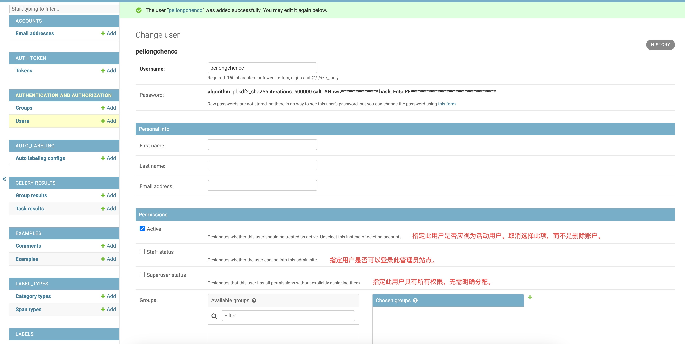

5. 权限设置成功后点击 "SAVE"，即可看到以下界面:

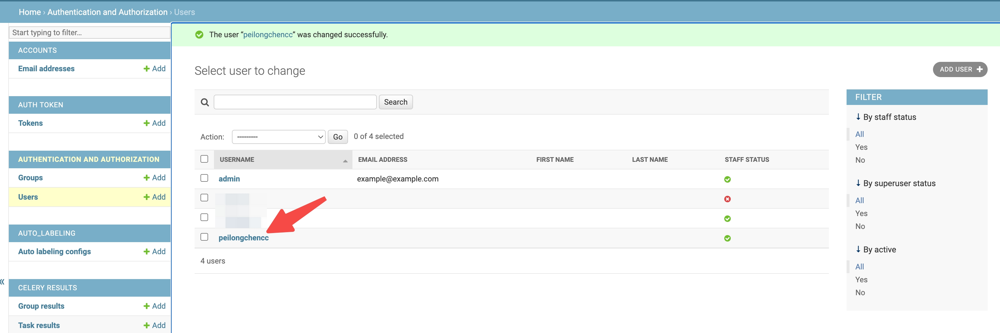

6. 关闭管理员站点，刷新doccano主页，找到你的项目，点击 "Members"；

7. 点击 "Add" ，拉取用户到当前项目，并设置用户角色。点击 "Save"；

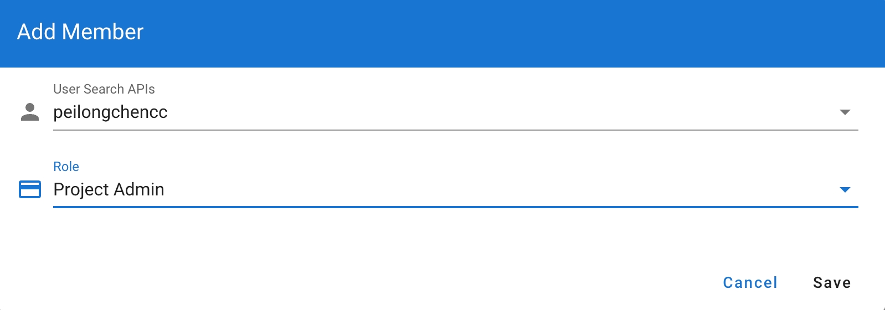

现在新用户已经拉到你指定的项目中了，他可以和你协作标注了。<br>

🚨🚨🚨注意: doccano 不支持实时显示，即你和同事同时操作某一个文件时，无法看到对方标注的内容，需要刷新界面才可以看到。所以，建议工作人员商量好，每个人负责的部分，避免重复标注引发错误。<br>


## 任务分配:

doccano不支持为在同一个项目中为不同用户分配不同数据集，这是因为Doccano的项目管理是基于项目级别的，而不是数据集级别的。可通过创建不同项目，为不同项目拉取不同成员实现任务分配(不同项目上传不同数据集)。<br>

