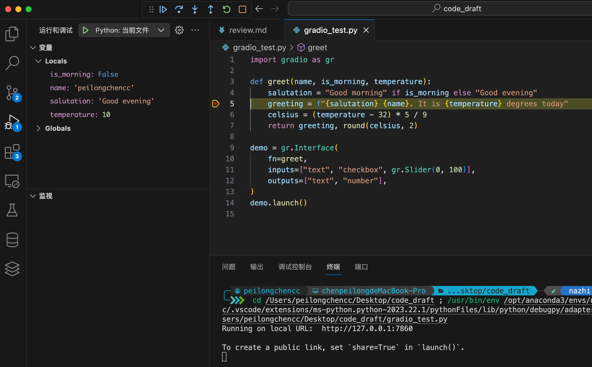
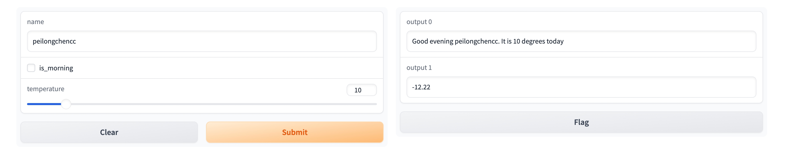

# gradio
- [gradio](#gradio)
  - [定义文本框大小:](#定义文本框大小)
  - [滑块和点击:](#滑块和点击)
  - [ChatInterface接口:](#chatinterface接口)
  - [流式输出:](#流式输出)


## 定义文本框大小:

```python
import gradio as gr

def greet(name):
    return "Hello " + name + "!"

demo = gr.Interface(
    fn=greet,
    inputs=gr.Textbox(lines=1, placeholder="Name Here..."), # 定义文本框大小
    outputs="text",
)
demo.launch()
```

由 `lines` 的数值大小定义文本框大小。<br>


## 滑块和点击:

假设你有一个更复杂的函数，具有多个输入和输出。在下面的示例中，我定义了一个函数，它接受字符串、布尔值和数字，并返回字符串和数字。看看如何传递输入和输出组件的列表:<br>

```python
import gradio as gr

def greet(name, is_morning, temperature):
    salutation = "Good morning" if is_morning else "Good evening"
    greeting = f"{salutation} {name}. It is {temperature} degrees today"
    celsius = (temperature - 32) * 5 / 9
    return greeting, round(celsius, 2)

demo = gr.Interface(
    fn=greet,
    inputs=["text", "checkbox", gr.Slider(0, 100)], # 此处按顺序对应`greet`函数中的参数
    outputs=["text", "number"], # 返回值依旧对应的`greet`函数的返回值,依旧是按顺序对应
)
demo.launch()
```







## ChatInterface接口:

`ChatInterface`接口会自定义用户输入和整理历史数据的格式。传入的函数必须接收两个参数：`message`和`history`，且这两个参数必须按照这个顺序排列。

1. **message**: 这是一个字符串（str），代表用户的输入。

2. **history**: 这是一个列表（list of lists），代表到目前为止的对话历史。每个内部列表包含两个字符串，代表一对对话：["user_input", "assistant"]。

```python
import gradio as gr

def alternatingly_agree(message, history):
    if len(history) % 2 == 0:
        return f"Yes, I do think that '{message}'"
    else:
        return "I don't think so"

demo = gr.ChatInterface(alternatingly_agree)
demo.launch()
```

## 流式输出:

```python
import time
import gradio as gr

def string_generator(message):
    for character in message:
        yield character

def predict(message, history):
    generated = ""  # 用于存储之前生成的字符
    data = string_generator(message)
    for item in data:
        time.sleep(0.3)     # 这里设置时间用于更直观的看出流式输出,没有其他特殊含义。
        generated += item  # 将新字符添加到存储的字符串中
        yield generated  # 输出逐渐增加的字符串


demo = gr.ChatInterface(
    predict,
    chatbot=gr.Chatbot(height=500),
    textbox=gr.Textbox(placeholder="Ask me a question...", container=False, scale=7),
    title="Dragon Chatbot",
    description="Ask Dragon Chatbot any question",
    theme="soft",
    examples=["Hello", "请给我一份读取json文件的python代码", "\"consist\"的中文含义是什么？"],
    cache_examples=True,
    retry_btn=None,
    undo_btn="删除上一轮对话",
    clear_btn="清空历史数据",
).queue()
demo.launch()
```

