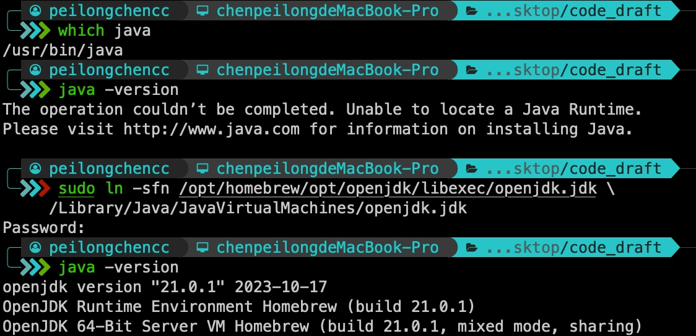

## java
- [java](#java)
- [安装java:](#安装java)
  - [Java环境变量配置:](#java环境变量配置)
- [安装Maven：](#安装maven)
  - [测试Maven：](#测试maven)
  - [创建一个新的Maven项目:](#创建一个新的maven项目)
  - [在 `pom.xml` 中添加依赖：](#在-pomxml-中添加依赖)
  - [安装依赖：](#安装依赖)

## 安装java:

Turns out java has been moved into brew core recently, so the correct command as of August 2022 is:<br>

> 现在通过brew安装java会自动安装javaJDK。

```bash
brew install java
```

Then check your installation by running<br>

```bash
java -version
```

If the result does not looks like this:<br>

```txt
openjdk 18.0.2 2022-07-19
OpenJDK Runtime Environment Homebrew (build 18.0.2+0)
OpenJDK 64-Bit Server VM Homebrew (build 18.0.2+0, mixed mode, sharing)
```

but like this:<br>

```txt
The operation couldn’t be completed. Unable to locate a Java Runtime.
Please visit http://www.java.com for information on installing Java.
```

Then you also need to create a symlink for the system Java wrappers to find this JDK:<br>

```bash
sudo ln -sfn /opt/homebrew/opt/openjdk/libexec/openjdk.jdk \
     /Library/Java/JavaVirtualMachines/openjdk.jdk
```




### Java环境变量配置:

运行以下指令查看本机java安装路径:<br>

```bash
/usr/libexec/java_home
```


根据自己的shell类型，修改配置文件。假设你使用的`zsh`，运行以下指令:<br>

```bash
vim ~/.zshrc
```

在文件末尾添加以下指令:<br>

> 注意修改为你自己上一步查看到的java安装路径。

```bash
# 设置java环境变量
export JAVA_HOME="/opt/homebrew/Cellar/openjdk/21.0.1/libexec/openjdk.jdk/Contents/Home"
```

添加好后，关闭 `.zshrc` 文件，运行下列指令激活环境配置:<br>

```bash
source ~/.zshrc
```

运行下列指令检查java环境变量是否配置正确:<br>

> 最好重启终端后尝试。

```bash
echo $JAVA_HOME
```

这应该会显示你之前设置的路径。<br>


## 安装Maven：

Maven是一个流行的Java项目管理和构建自动化工具。Maven使用项目对象模型（POM）来管理项目的构建，报告和文档。<br>

Java通常通过Maven或Gradle这样的构建工具来管理依赖项。这里介绍Maven安装第三方库的方式：<br>

```bash
brew install maven
```

### 测试Maven：

终端尝试运行以下指令检查java和maven的安装:<br>

```bash
mvn --version
```

### 创建一个新的Maven项目:

创建一个新的Maven项目的指令如下:<br>

```bash
mvn archetype:generate -DgroupId=com.alichatbot -DartifactId=alichat -DarchetypeArtifactId=maven-archetype-quickstart -DinteractiveMode=false
```

> 如果你不需要项目默认生成的 `App.java` 文件，你可以安全地将其删除。
> 这个文件是由 Maven 使用 `maven-archetype-quickstart` 形成的模板生成的，仅作为示例和起始点。

指令解释:<br>

1. `mvn archetype:generate`：
   - `mvn` 是运行Maven命令的基本方式。
   - `archetype:generate` 是Maven命令的一部分，用于生成一个项目原型（archetype）。原型是一种项目模板，用于帮助快速开始具有一定结构的项目。

2. `-DgroupId=com.alichatbot`：
   - `-D` 是设置Java系统属性的方式。
   - `groupId` 是项目的唯一基础名称，通常是你或你公司的域名反向写成。在这个例子中，它被设置为 `com.alichatbot`。

> 只要你的 Java 代码正确编写且没有错误，不论 `groupId` 如何设置，代码都应该能够正常运行。`groupId`影响的是你的文件夹结构。

3. `-DartifactId=alichat`：
   - `artifactId` 是你的项目的名称，这在Maven仓库中用于唯一标识你的项目。在这个例子中，项目名被设置为 `alichat`。

4. `-DarchetypeArtifactId=maven-archetype-quickstart`：
   - `archetypeArtifactId` 指定了要使用的原型的名称。`maven-archetype-quickstart` 是Maven提供的一个基本原型，适合创建简单的Java应用。

5. `-DinteractiveMode=false`：
   - 这告诉Maven在非交互模式下运行，这意味着它不会询问用户输入，而是使用提供的命令行参数。

总的来说，这条命令用于创建一个名为 `alichat` 的新Maven项目，其组织名为 `com.alichatbot`，并使用 `maven-archetype-quickstart` 作为基本原型来设置项目结构。这样做可以快速开始一个标准的Java项目。<br>

生成的文件夹的目录树如下:<br>

```txt
alichat
├── pom.xml
└── src
    ├── main
    │   └── java
    │       └── com
    │           └── alichatbot
    │               └── App.java
    └── test
        └── java
            └── com
                └── alichatbot
                    └── AppTest.java
```

如果你打算使用自己的java文件，可以将`App.java`文件删除，在相同位置添加自己的代码，目录树如下:<br>

```txt
alichat
├── pom.xml
└── src
    ├── main
    │   └── java
    │       └── com
    │           └── alichatbot
    │               ├── Test.java
    │               └── SSEListener.java
    └── test
```

### 在 `pom.xml` 中添加依赖：

将需要添加以下依赖项到你的 `pom.xml` 文件中，可参考笔者的 `pom.xml`文件：<br>

```xml
<project xmlns="http://maven.apache.org/POM/4.0.0" xmlns:xsi="http://www.w3.org/2001/XMLSchema-instance"
  xsi:schemaLocation="http://maven.apache.org/POM/4.0.0 http://maven.apache.org/maven-v4_0_0.xsd">
  <modelVersion>4.0.0</modelVersion>
  <groupId>com.alichatbot</groupId>
  <artifactId>alichat</artifactId>
  <packaging>jar</packaging>
  <version>1.0-SNAPSHOT</version>
  <name>alichat</name>
  <url>http://maven.apache.org</url>
  <properties>
      <!-- 指定java版本，注意改为自己的java版本 -->
      <maven.compiler.source>21</maven.compiler.source>
      <maven.compiler.target>21</maven.compiler.target>
      <!-- 指定utf-8编码 -->
      <project.build.sourceEncoding>UTF-8</project.build.sourceEncoding>
      <project.reporting.outputEncoding>UTF-8</project.reporting.outputEncoding>
  </properties>
  <dependencies>
    <dependency>
      <groupId>com.aliyun</groupId>
      <artifactId>chatbot20220408</artifactId>
      <version>1.0.9</version>
    </dependency>
    <dependency>
        <groupId>com.aliyun</groupId>
        <artifactId>aliyun-java-sdk-core</artifactId>
        <version>4.6.4</version>
    </dependency>
    <dependency>
        <groupId>com.alibaba</groupId>
        <artifactId>fastjson</artifactId>
        <version>1.2.72_noneautotype</version>
    </dependency>
    <dependency>
        <groupId>com.squareup.okhttp3</groupId>
        <artifactId>okhttp-sse</artifactId>
        <version>4.9.3</version>
    </dependency>
    <dependency>
        <groupId>com.google.guava</groupId>
        <artifactId>guava</artifactId>
        <version>24.1-jre</version>
    </dependency>
    <!-- 可添加其他依赖 -->
  </dependencies>
</project>
```

### 安装依赖：

在终端中，导航到包含 `pom.xml` 的目录，然后运行：<br>

```bash
mvn clean install
```

> 也可以选择运行 `mvn compile` ，这个命令只会生成`target`目录，而不会清理以往的目录。

运行`mvn clean install`后，会生成一个`target`目录，同时终端显示信息如下:<br>

```txt
[INFO] Scanning for projects...
[INFO] 
[INFO] -----------------------< com.alichatbot:alichat >-----------------------
[INFO] Building alichat 1.0-SNAPSHOT
[INFO]   from pom.xml
[INFO] --------------------------------[ jar ]---------------------------------
[INFO] 
[INFO] --- clean:3.2.0:clean (default-clean) @ alichat ---
[INFO] 
[INFO] --- resources:3.3.1:resources (default-resources) @ alichat ---
[INFO] skip non existing resourceDirectory /Users/peilongchencc/Desktop/maven_test/alichat/src/main/resources
[INFO] 
[INFO] --- compiler:3.11.0:compile (default-compile) @ alichat ---
[INFO] Changes detected - recompiling the module! :source
[INFO] Compiling 2 source files with javac [debug target 21] to target/classes
[INFO] 
[INFO] --- resources:3.3.1:testResources (default-testResources) @ alichat ---
[INFO] skip non existing resourceDirectory /Users/peilongchencc/Desktop/maven_test/alichat/src/test/resources
[INFO] 
[INFO] --- compiler:3.11.0:testCompile (default-testCompile) @ alichat ---
[INFO] Changes detected - recompiling the module! :dependency
[INFO] 
[INFO] --- surefire:3.2.2:test (default-test) @ alichat ---
[INFO] 
[INFO] --- jar:3.3.0:jar (default-jar) @ alichat ---
[INFO] Building jar: /Users/peilongchencc/Desktop/maven_test/alichat/target/alichat-1.0-SNAPSHOT.jar
[INFO] 
[INFO] --- install:3.1.1:install (default-install) @ alichat ---
[INFO] Installing /Users/peilongchencc/Desktop/maven_test/alichat/pom.xml to /Users/peilongchencc/.m2/repository/com/alichatbot/alichat/1.0-SNAPSHOT/alichat-1.0-SNAPSHOT.pom
[INFO] Installing /Users/peilongchencc/Desktop/maven_test/alichat/target/alichat-1.0-SNAPSHOT.jar to /Users/peilongchencc/.m2/repository/com/alichatbot/alichat/1.0-SNAPSHOT/alichat-1.0-SNAPSHOT.jar
[INFO] ------------------------------------------------------------------------
[INFO] BUILD SUCCESS
[INFO] ------------------------------------------------------------------------
[INFO] Total time:  1.169 s
[INFO] Finished at: 2024-01-16T11:55:15+08:00
[INFO] ------------------------------------------------------------------------
```

现在，在文件中右键点击 `run java` 运行文件。<br>