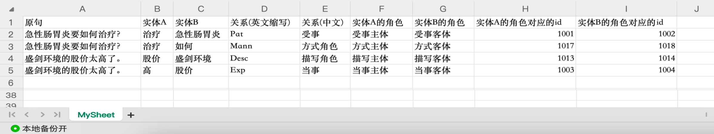

# Openpyxl

`openpyxl` 是一个用于操作 Excel 文件的 Python 库，它允许你创建、读取和修改 Excel 文件（.xlsx 格式）。<br>

- [Openpyxl](#openpyxl)
  - [安装 `openpyxl`：](#安装-openpyxl)
  - [导入库：](#导入库)
  - [打开 Excel 文件：](#打开-excel-文件)
  - [选择工作表(sheet)：](#选择工作表sheet)
  - [读取单元格的值：](#读取单元格的值)
  - [写入数据到单元格：](#写入数据到单元格)
  - [保存工作簿：](#保存工作簿)
  - [创建新的工作表：](#创建新的工作表)
  - [创建新的工作薄(xlsx文件):](#创建新的工作薄xlsx文件)
    - [将数据存入新创建的工作薄(xlsx文件)示例:](#将数据存入新创建的工作薄xlsx文件示例)
    - [创建新的工作表并添加数据的示例代码如下：](#创建新的工作表并添加数据的示例代码如下)
  - [遍历工作表中的数据：](#遍历工作表中的数据)
  - [删除工作表：](#删除工作表)
  - [结语：](#结语)


## 安装 `openpyxl`：

`openpyxl` 库可以使用 pip 安装：<br>

```bash
pip install openpyxl
```

## 导入库：

`openpyxl`可以直接通过`import`导入，也可以通过`from openpyxl import xxx`的方式导入。直接通过`import`导入方式如下：<br>

```python
import openpyxl
```

通过`from openpyxl import xxx`导入，你首先要知道你在做什么，例如，创建一个新的工作簿（Excel 文件）示例如下：<br>

> 创建一个新的工作簿（Excel 文件），而不是一个新的工作表。工作簿是一个包含一个或多个工作表的容器。

```python
from openpyxl import Workbook
```

通过 `Workbook` 类创建的对象代表一个新的 Excel 工作簿，你可以在其中添加工作表以及向工作表添加数据。如果你需要创建一个新的工作表，可以使用 `create_sheet()` 方法，如前面的示例所示。<br>


## 打开 Excel 文件：

使用 `openpyxl` 打开一个 Excel 文件：<br>

```python
from openpyxl import load_workbook

workbook = load_workbook('example.xlsx')  # 替换 'example.xlsx' 为你的文件名
```

## 选择工作表(sheet)：

选择要操作的工作表(sheet)：<br>

```python
sheet = workbook.active  # 默认选择第一个工作表
# 或者
sheet = workbook['Sheet1']  # 通过工作表名称选择
```

## 读取单元格的值：

你可以使用 `cell` 对象来读取单元格的值：<br>

```python
cell_value = sheet['A1'].value
# 或者
cell_value = sheet.cell(row=1, column=1).value
```

## 写入数据到单元格：

你可以使用 `cell` 对象来写入数据到单元格：<br>

```python
sheet['A1'] = 'Hello, World!'
```

## 保存工作簿：

保存你的修改到 Excel 文件：<br>

```python
workbook.save('example.xlsx')
```

## 创建新的工作表：

你可以创建新的工作表并向其中添加数据：<br>

```python
new_sheet = workbook.create_sheet('NewSheet')
new_sheet['A1'] = 'This is a new sheet'
```

## 创建新的工作薄(xlsx文件):

```python
from openpyxl import Workbook

# 创建一个新的Excel工作簿和工作表
workbook = Workbook()
worksheet = workbook.active # 默认选择第一个工作表
```

### 将数据存入新创建的工作薄(xlsx文件)示例:

```python
from openpyxl import Workbook

# 创建一个新的Excel工作簿和工作表
workbook = Workbook()
worksheet = workbook.active # 默认选择第一个工作表

# 修改工作表的名称
worksheet.title = "MySheet"  # 将工作表名称设置为"MySheet"

# 添加表头行
header = ["原句", "实体A", "实体B", "关系(英文缩写)", "关系(中文)", "实体A的角色", "实体B的角色", "实体A的角色对应的id", "实体B的角色对应的id"]
worksheet.append(header)

semantic_triples = [['急性肠胃炎要如何治疗？', '治疗', '急性肠胃炎', 'Pat', '受事', '受事主体', '受事客体', 1001, 1002], 
                    ['急性肠胃炎要如何治疗？', '治疗', '如何', 'Mann', '方式角色', '方式主体', '方式客体', 1017, 1018], 
                    ['盛剑环境的股价太高了。', '股价', '盛剑环境', 'Desc', '描写角色', '描写主体', '描写客体', 1013, 1014], 
                    ['盛剑环境的股价太高了。', '高', '股价', 'Exp', '当事', '当事主体', '当事客体', 1003, 1004]]

# 将数据写入工作表
for item in semantic_triples:
    worksheet.append(item)

# 待保存的文件路径
result_output_file_path = "output.xlsx"

# 保存Excel文件
workbook.save(result_output_file_path)

print(f"数据已写入{result_output_file_path}文件")
```

运行上述代码，将默认在当前目录下创建一个`output.xlsx`文件。如果你用WPS或office打开将显示如下内容：<br>




### 创建新的工作表并添加数据的示例代码如下：

```python
from openpyxl import Workbook

# 创建一个新的工作簿
workbook = Workbook()

# 创建一个新的工作表
new_sheet = workbook.create_sheet('NewSheet')

# 向新工作表中添加数据
new_sheet['A1'] = 'This is a new sheet'
new_sheet['A2'] = 'Data in row 2'
new_sheet['B2'] = 'Data in row 2, column 2'

# 保存工作簿
workbook.save('example.xlsx')
```

这段代码首先创建一个新的工作簿（Excel 文件），然后使用 `create_sheet()` 方法创建了一个名为 "NewSheet" 的新工作表，并向该工作表中添加了一些数据。最后，使用 `save()` 方法保存工作簿。在这个示例中，工作簿将保存为 "example.xlsx"。你可以将文件名替换为你喜欢的任何名称。<br>

## 遍历工作表中的数据：

你可以使用 `iter_rows()` 方法遍历工作表中的行：<br>

```python
for row in sheet.iter_rows(min_row=1, max_row=5, min_col=1, max_col=3):
    for cell in row:
        print(cell.value)
```

## 删除工作表：

你可以删除不需要的工作表：<br>

```python
workbook.remove(sheet)
```

## 结语：

这只是 `openpyxl` 的一些基本用法示例，你可以根据自己的需求进一步探索库的功能，如合并单元格、设置单元格样式、处理图表等等。<br>

`openpyxl` 的官方文档也提供了详细的信息和示例，可以帮助你更深入地了解库的功能和用法。<br>


