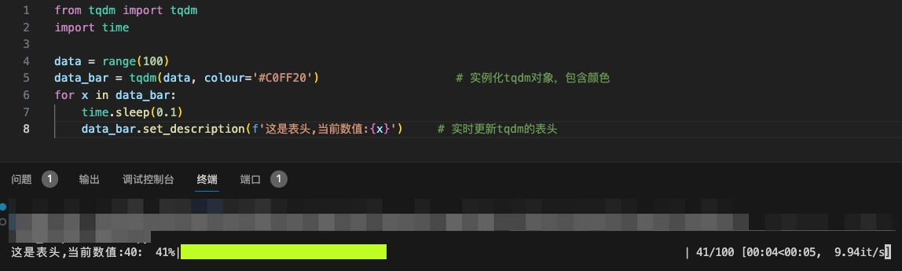

# tqdm

"tqdm" 是一个Python库，用于在命令行界面中创建进度条，以显示代码执行的进度。它通常用于循环迭代或长时间运行的任务，以便用户可以清楚地看到任务的进度。<br>

在命令行界面中创建进度条库还有其他，例如`Alive Progress`，`Alive Progress`的动画效果更多，感兴趣就自己了解下吧，这里只讲解tqdm的使用，原因在于方便，你如果有更多进度条样式方面的需求，也可以使用其他库。<br>

- [tqdm](#tqdm)
  - [tqdm安装:](#tqdm安装)
  - [基本用法:](#基本用法)
  - [tdqm参数详解：](#tdqm参数详解)
  - [自定义进度条描述示例：](#自定义进度条描述示例)
  - [自定义进度条颜色:](#自定义进度条颜色)
    - [直接使用html颜色代码实现黄绿色进度条:](#直接使用html颜色代码实现黄绿色进度条)
    - [借助colorama实现蓝色进度条:](#借助colorama实现蓝色进度条)
  - [在嵌套循环中使用 "tqdm"示例：](#在嵌套循环中使用-tqdm示例)
  - [tqdm和enumerate联合使用示例：](#tqdm和enumerate联合使用示例)
    - [enumerate包裹tqdm:](#enumerate包裹tqdm)
    - [tdqm包裹enumate,使用total参数:](#tdqm包裹enumate使用total参数)


## tqdm安装:

如果你还没有安装 "tqdm"，可以使用以下命令安装它：<br>

```bash
pip install tqdm
```

## 基本用法:

```python
from tqdm import tqdm
import time

# 创建一个可迭代对象，例如一个列表
items = range(10)

# 使用 tqdm 包装这个可迭代对象以创建进度条
for item in tqdm(items):
    # 模拟任务的执行时间
    time.sleep(0.2)
```

上述代码中，我们首先导入了 "tqdm" 模块，然后创建了一个包含 10 个元素的范围对象。然后，我们使用 "tqdm" 包装这个范围对象，迭代它时 "tqdm" 将自动创建一个进度条来跟踪循环的进度。<br>

## tdqm参数详解：

| 参数名       | 类型   | 描述                                                        |
|--------------|--------|-------------------------------------------------------------|
| iterable     | 可迭代对象 | 在手动更新时不需要进行设置                                   |
| desc         | str    | 左边进度条的描述性文字                                      |
| total        | int    | 总的项目数                                                  |
| leave        | bool   | 执行完成后是否保留进度条                                   |
| file         | str    | 输出指向位置，默认是终端，一般不需要设置                     |
| ncols        | int    | 调整进度条宽度，默认根据环境自动调节长度，如果设置为0，则没有进度条，只有输出的信息 |
| unit         | str    | 描述处理项目的文字，默认是'it'，例如：100 it/s，处理照片的话设置为'img'，则为100 img/s |
| unit_scale   | bool   | 自动根据国际标准进行项目处理速度单位的换算，例如100000 it/s >> 100k it/s |
| colour       | str    | 进度条颜色，例如：'green'，'#00ff00'                         |


## 自定义进度条描述示例：

```python
from tqdm import tqdm
import time

items = range(10)

# 自定义进度条描述
for item in tqdm(items, desc="Processing items"):
    time.sleep(0.2)
```

## 自定义进度条颜色:

### 直接使用html颜色代码实现黄绿色进度条:

tqdm可以直接使用html颜色代码，任何颜色都可以，例如colour = "#FF5733"<br>

```python
from tqdm import tqdm
import time

data = range(100)
data_bar = tqdm(data, colour='#C0FF20')                    # 实例化tqdm对象，包含颜色
for x in data_bar:
    time.sleep(0.1)
    data_bar.set_description(f'这是表头,当前数值:{x}')     # 实时更新tqdm的表头
```

🐳🐳🐳`data_bar.set_description()`与tqdm的参数 `desc="Processing items"` 效果相似，区别在于前者能动态更新表头。<br>

终端效果:<br>



### 借助colorama实现蓝色进度条:

```python
from tqdm import tqdm
from colorama import Fore
import time

items = range(10)

for item in tqdm(items, desc="Processing items", bar_format='{l_bar}%s{bar}%s{r_bar}' % (Fore.BLUE, Fore.RESET)):
    time.sleep(0.2)
```

终端效果:<br>


## 在嵌套循环中使用 "tqdm"示例：

```python
from tqdm import tqdm
import time

# 嵌套循环示例
for i in tqdm(range(5), desc="Outer Loop"):
    for j in tqdm(range(10), desc="Inner Loop", leave=False):
        time.sleep(0.1)
```

代码解释:<br>

以 "Outer Loop" 进度条为主，主要更新 "Outer Loop" 进度条的状态，`leave=False`表示每一轮 "Inner Loop" 进度条满100%后不显示。<br>


## tqdm和enumerate联合使用示例：

### enumerate包裹tqdm:

```python
from tqdm import tqdm
import time

# 假设你有一个列表或任何可迭代对象
my_list = [num for num in range(100)]

# 使用 tqdm 包裹迭代器
for i, item in enumerate(tqdm(my_list)):
    # 在这里执行你的操作
    print(f"处理元素 {i}: {item}")
    time.sleep(0.1)
```

### tdqm包裹enumate,使用total参数:

```python
from tqdm import tqdm
import time

# 假设你有一个列表或任何可迭代对象
my_list = [num for num in range(100)]

# 使用 tqdm 包裹迭代器
for i, item in tqdm(enumerate(my_list), total=len(my_list)):
    # 在这里执行你的操作
    print(f"处理元素 {i}: {item}")
    time.sleep(0.1)
```

